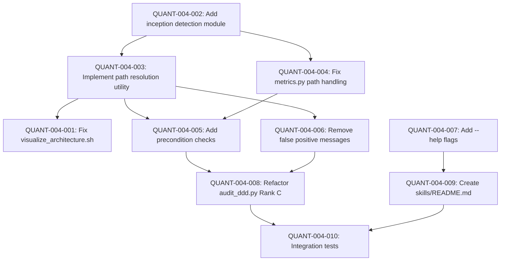

# REQ-004: QUANT TASK DECOMPOSITION

**Requirement**: Skills Production Readiness Refactoring  
**Decomposition Date**: 2025-11-25  
**Domain Analysis**: `REQ-004_domain_analysis.md`

---

## OBJECTIVE

Refactor all framework skills (check_complexity.sh, visualize_architecture.sh, check_coverage.sh, audit_ddd.py, metrics.py) to production quality with inception-aware execution, proper error handling, graceful degradation, and cross-platform reliability, enabling framework dogfooding and reliable QUANT verification gates.

---

## CENTRAL INVARIANT TO SATISFY

```
∀ skill ∈ {check_complexity, visualize_architecture, check_coverage, audit_ddd, metrics}:
  (skill.executes_in_inception_mode = TRUE) ∧
  (skill.exit_code_accurate = TRUE) ∧
  (skill.false_positives = 0) ∧
  (skill.graceful_degradation = TRUE) ∧
  (skill.cross_platform = TRUE)
  
WHERE:
  inception_mode = exists(core/SUPER_AGENT.md)
  exit_code_accurate = (command_succeeds ⇔ exit_code = 0)
  false_positives = count(output_says_success ∧ exit_code ≠ 0)
  graceful_degradation = ∀ missing_dep: (warn ∧ ¬crash)
```

---

## QUANT TASK DEPENDENCY GRAPH



---

## EXECUTION SEQUENCE

**Critical Path**: Q002 → Q003 → Q005 → Q008 → Q010 (6.5h)

**Parallel Opportunities**:
- Q001 (fix visualize) can run parallel with Q004 (metrics)
- Q007 (--help) independent, can run anytime before Q009

**Total Effort**: 10h  
**Estimated Duration**: 6.5h (considering parallelism)

### Sequential Order
1. ✅ QUANT-004-001 (0.5h, LOW risk) - Fix visualize_architecture.sh pydeps flag
2. ⏳ QUANT-004-002 (1h, LOW risk) - Add inception detection module  
3. ⏳ QUANT-004-003 (1h, LOW risk) - Implement path resolution utility
4. ⏳ QUANT-004-004 (1h, MEDIUM risk) - Fix metrics.py path handling [PARALLEL with Q001]
5. ⏳ QUANT-004-005 (1.5h, MEDIUM risk) - Add precondition checks (all skills)
6. ⏳ QUANT-004-006 (1h, LOW risk) - Remove false positive messages
7. ⏳ QUANT-004-007 (1h, LOW risk) - Add --help flags [PARALLEL anytime]
8. ⏳ QUANT-004-008 (2h, HIGH risk) - Refactor audit_ddd.py Rank C functions
9. ⏳ QUANT-004-009 (0.5h, LOW risk) - Create comprehensive skills/README.md
10. ⏳ QUANT-004-010 (0.5h, MEDIUM risk) - Integration tests (dogfooding validation)

---

## DETAILED QUANT TASKS

### QUANT-004-001: Fix visualize_architecture.sh pydeps Flag

**Type**: INFRA  
**Layer**: Infrastructure (Skills)  
**Bounded Context**: Skills

**Invariant**:
```
∀ execution: pydeps_command_succeeds ⇒ (svg_file_created ∧ exit_code = 0)
∧ pydeps_command_fails ⇒ (error_message_displayed ∧ exit_code ≠ 0)
```

**Description**:
Fix critical bug in `visualize_architecture.sh` where pydeps is called with wrong flag (`--output`) instead of correct flag (`-o`). Add proper error handling with ShellCheck-compliant exit code propagation. Remove false positive "Graph generated" message that prints even when pydeps fails.

**Acceptance Criteria**:
- [ ] **AC1**: pydeps called with `-o` flag (not `--output`)
  - Verification: `grep -q '\-o' skills/visualize_architecture.sh && ! grep -q '\-\-output' skills/visualize_architecture.sh`
- [ ] **AC2**: Success message only prints when pydeps succeeds
  - Verification: Execute skill with invalid target → No "✅ Graph generated" message
- [ ] **AC3**: Exit code 0 when graph generated, non-zero on failure
  - Verification: `sh skills/visualize_architecture.sh . graph.svg && [ $? -eq 0 ]`
- [ ] **AC4**: Error message provides actionable guidance
  - Verification: Skill prints installation hint when uv missing

**Dependencies**: `[]`

**Files Affected**:
- `skills/visualize_architecture.sh`: MODIFY - Fix pydeps flag, add error handling

**Implementation Notes**:
```bash
# BEFORE (broken)
uv run --with pydeps pydeps "$TARGET_DIR" --output "$OUTPUT_FILE"
echo "✅ Graph generated at $OUTPUT_FILE"

# AFTER (correct)
if uv run --with pydeps pydeps "$TARGET_DIR" \
    --exclude "tests/*" "venv/*" "migrations/*" "sia/*" ".venv/*" \
    --noshow \
    --max-bacon 2 \
    -o "$OUTPUT_FILE"; then
    echo "✅ Graph generated at $OUTPUT_FILE"
    exit 0
else
    echo "❌ Failed to generate architecture graph"
    echo "   Hint: Ensure uv is installed: pip install uv"
    exit 1
fi
```

**Test Strategy**:
- Execute on SIA framework: `sh skills/visualize_architecture.sh . test_graph.svg`
- Verify SVG file created
- Check exit code: `echo $?` → should be 0
- Simulate failure (invalid path) → verify exit code ≠ 0

---

### QUANT-004-002: Add Inception Detection Module

**Type**: INFRA  
**Layer**: Infrastructure (Skills/Core)  
**Bounded Context**: Skills

**Invariant**:
```
is_inception_mode() ⇔ exists(core/SUPER_AGENT.md)
∧ ∀ skill: skill.uses_inception_detection = TRUE
```

**Description**:
Create reusable inception detection logic that all skills can use to determine if running in SIA framework itself (inception mode) or in an inherited project (submodule mode). Implement both bash and Python versions for cross-skill consistency.

**Acceptance Criteria**:
- [ ] **AC1**: Bash function `is_inception_mode` returns true when `core/SUPER_AGENT.md` exists
  - Verification: Test in SIA repo: `is_inception_mode && echo "TRUE" | grep TRUE`
- [ ] **AC2**: Python function `is_inception_mode()` returns bool correctly
  - Verification: `python3 -c "from skills.utils import is_inception_mode; assert is_inception_mode(Path('.'))"` (in SIA repo)
- [ ] **AC3**: Function works from any working directory (absolute path resolution)
  - Verification: `cd skills && is_inception_mode` → TRUE (in SIA repo)

**Dependencies**: `[]`

**Files Affected**:
- `skills/utils.sh`: CREATE - Bash utility functions (inception detection, path resolution)
- `skills/utils.py`: CREATE - Python utility module (inception detection, path utilities)

**Implementation Notes**:
```bash
# skills/utils.sh
is_inception_mode() {
    # Returns 0 (true) if running in SIA framework itself
    # Returns 1 (false) if running in inherited project (submodule)
    if [ -f "core/SUPER_AGENT.md" ]; then
        return 0  # Inception mode
    else
        return 1  # Submodule mode
    fi
}
```

```python
# skills/utils.py
from pathlib import Path

def is_inception_mode(root: Path = Path(".")) -> bool:
    """
    Detect if running in SIA framework itself (inception) or inherited project (submodule).
    
    Returns:
        True if core/SUPER_AGENT.md exists (inception mode)
        False otherwise (submodule mode)
    """
    return (root.resolve() / "core" / "SUPER_AGENT.md").exists()

def get_skills_directory(root: Path = Path(".")) -> Path:
    """
    Get correct skills directory based on execution mode.
    
    Returns:
        root/skills (inception) or root/sia/skills (submodule)
    """
    if is_inception_mode(root):
        return root / "skills"
    else:
        return root / "sia" / "skills"
```

**Test Strategy**:
- Unit test in SIA repo: `is_inception_mode()` → True
- Unit test in mock submodule structure: `is_inception_mode()` → False
- Test path resolution: Correct skills/ vs sia/skills/

---

### QUANT-004-003: Implement Path Resolution Utility

**Type**: INFRA  
**Layer**: Infrastructure (Skills)  
**Bounded Context**: Skills

**Invariant**:
```
resolve_skill_path(skill_name) = first_match([skills/skill_name, sia/skills/skill_name, ∅])
∧ ∀ skill_invocation: uses_resolved_path = TRUE
```

**Description**:
Create path resolution utility that dynamically finds skill files/scripts whether running in inception mode (skills/ at root) or submodule mode (sia/skills/). Eliminates hardcoded `sia/skills/metrics.py` references that break in inception.

**Acceptance Criteria**:
- [ ] **AC1**: `resolve_skill_path("metrics.py")` returns correct path in both modes
  - Verification (inception): Returns `skills/metrics.py`
  - Verification (submodule): Returns `sia/skills/metrics.py`
- [ ] **AC2**: Returns empty string when skill not found
  - Verification: `resolve_skill_path("nonexistent.py")` → ""
- [ ] **AC3**: All bash skills use `resolve_skill_path` for metrics calls
  - Verification: `grep -r "sia/skills/metrics.py" skills/*.sh` → No matches

**Dependencies**: `[QUANT-004-002]` (inception detection)

**Files Affected**:
- `skills/utils.sh`: MODIFY - Add `resolve_skill_path()` function
- `skills/check_complexity.sh`: MODIFY - Use `resolve_skill_path`
- `skills/visualize_architecture.sh`: MODIFY - Use `resolve_skill_path`
- `skills/check_coverage.sh`: MODIFY - Use `resolve_skill_path`

**Implementation Notes**:
```bash
# skills/utils.sh
resolve_skill_path() {
    local skill_name=$1
    
    # Try inception mode path first
    if [ -f "skills/$skill_name" ]; then
        echo "skills/$skill_name"
        return 0
    fi
    
    # Try submodule mode path
    if [ -f "sia/skills/$skill_name" ]; then
        echo "sia/skills/$skill_name"
        return 0
    fi
    
    # Not found
    echo ""
    return 1
}

# Usage in skills
METRICS_PATH=$(resolve_skill_path "metrics.py")
if [ -n "$METRICS_PATH" ]; then
    uv run --with pyyaml python3 "$METRICS_PATH" check_complexity target="$TARGET_DIR" 2>/dev/null || true
fi
```

**Test Strategy**:
- Test in SIA repo: `resolve_skill_path("metrics.py")` → "skills/metrics.py"
- Test in mock submodule: `resolve_skill_path("metrics.py")` → "sia/skills/metrics.py"
- Execute skills after modification → metrics logging works in both modes

---

### QUANT-004-004: Fix metrics.py Path Handling

**Type**: INFRA  
**Layer**: Infrastructure (Skills)  
**Bounded Context**: Skills

**Invariant**:
```
get_metrics_path() = {
  skills/metrics.yaml     if is_inception_mode()
  .sia/metrics.yaml       otherwise
}
∧ metrics_file_created_in_correct_location = TRUE
```

**Description**:
Fix `metrics.py` to detect inception mode and write metrics to correct location: `skills/metrics.yaml` (inception) vs `.sia/metrics.yaml` (submodule). Remove hardcoded `.agents/skills_metrics.yaml` (legacy structure).

**Acceptance Criteria**:
- [ ] **AC1**: In inception mode, metrics written to `skills/metrics.yaml`
  - Verification: Execute skill in SIA repo → `ls skills/metrics.yaml` exists
- [ ] **AC2**: In submodule mode, metrics written to `.sia/metrics.yaml`
  - Verification: Execute in mock submodule → `ls .sia/metrics.yaml` exists
- [ ] **AC3**: No references to legacy `.agents/` path
  - Verification: `grep -q '\.agents' skills/metrics.py` → No matches
- [ ] **AC4**: Metrics logging failure doesn't crash calling skill
  - Verification: Delete metrics.yaml → skill still executes successfully

**Dependencies**: `[QUANT-004-002]` (inception detection module)

**Files Affected**:
- `skills/metrics.py`: MODIFY - Add inception detection, dynamic path resolution

**Implementation Notes**:
```python
# skills/metrics.py
from pathlib import Path
from typing import Optional
import yaml
from datetime import datetime

# Import inception detection (assuming utils.py created in QUANT-002)
try:
    from skills.utils import is_inception_mode
except ImportError:
    # Fallback if utils.py not yet available
    def is_inception_mode(root: Path = Path(".")) -> bool:
        return (root / "core" / "SUPER_AGENT.md").exists()

class SkillMetrics:
    def __init__(self, root_dir: str = "."):
        self.root = Path(root_dir).resolve()
        
        # Detect execution mode and set correct path
        if is_inception_mode(self.root):
            # Inception mode: we ARE the framework
            self.metrics_file = self.root / "skills" / "metrics.yaml"
        else:
            # Submodule mode: inherited project
            self.metrics_file = self.root / ".sia" / "metrics.yaml"
        
        # Ensure directory exists
        self.metrics_file.parent.mkdir(parents=True, exist_ok=True)
    
    # Rest of implementation unchanged...
```

**Test Strategy**:
- Execute in SIA repo: Check `skills/metrics.yaml` created
- Execute in mock submodule: Check `.sia/metrics.yaml` created
- Simulate permission error → verify skill doesn't crash

---

### QUANT-004-005: Add Precondition Checks (All Skills)

**Type**: INFRA  
**Layer**: Infrastructure (Skills)  
**Bounded Context**: Skills

**Invariant**:
```
∀ skill ∈ {check_complexity, visualize_architecture, check_coverage, audit_ddd}:
  ∀ required_tool t: ¬available(t) ⇒ (display_install_guide ∧ exit(1))
  ∧ ∀ required_dir d: ¬exists(d) ⇒ (warn_user ∧ exit(0))
```

**Description**:
Add graceful degradation to all skills by validating preconditions before execution. Check tool availability (uv, radon, pydeps, pytest), provide installation guidance. Check directory existence (tests/), warn user without crashing. Implement pytest-inspired pattern where missing tests/ exits 0 (warning) not 1 (error).

**Acceptance Criteria**:
- [ ] **AC1**: `check_coverage.sh` detects missing tests/ directory, prints warning, exits 0
  - Verification: Remove tests/ → Execute → Exit code 0, warning displayed
- [ ] **AC2**: All skills detect missing uv, print installation hint, exit 1
  - Verification: Rename uv binary → Execute skill → Installation guide displayed
- [ ] **AC3**: `audit_ddd.py` detects missing domain/, prints clear message, exits 0
  - Verification: Execute on non-DDD project → Informative skip message
- [ ] **AC4**: `audit_ddd.py` detects inception mode, skips DDD audit with explanation
  - Verification: Execute on SIA framework → "Detected meta-framework, skipping DDD audit"

**Dependencies**: `[QUANT-004-003, QUANT-004-004]` (path resolution, metrics fixed)

**Files Affected**:
- `skills/check_coverage.sh`: MODIFY - Add tests/ directory check
- `skills/check_complexity.sh`: MODIFY - Add uv availability check
- `skills/visualize_architecture.sh`: MODIFY - Add uv availability check
- `skills/audit_ddd.py`: MODIFY - Add inception detection, graceful skip

**Implementation Notes**:
```bash
# check_coverage.sh - Missing directory check
if [ ! -d "$TEST_DIR" ]; then
    echo "⚠️  Test directory '$TEST_DIR' not found"
    echo "   This is not an error - no tests to run."
    echo "   To enable coverage analysis:"
    echo "   1. Create tests/ directory"
    echo "   2. Add test files (test_*.py)"
    echo "   3. Run again: sh skills/check_coverage.sh"
    exit 0  # Exit gracefully, not with error
fi

# All bash skills - Tool availability check
if ! command -v uv &> /dev/null; then
    echo "❌ uv is not installed"
    echo "   Install via pip: pip install uv"
    echo "   Or official installer: curl -LsSf https://astral.sh/uv/install.sh | sh"
    exit 1
fi
```

```python
# audit_ddd.py - Inception detection
def audit(self):
    print(f"🔍 Auditing DDD Compliance in {self.root.resolve()}...")
    
    # Detect if this is SIA framework itself
    if (self.root / "core" / "SUPER_AGENT.md").exists():
        print("⚠️  Detected SIA framework (meta-framework).")
        print("   Skipping DDD audit (framework uses different architecture).")
        print("   SIA structure: core/ → agents/ → skills/ → requirements/")
        return
    
    if not self.domain_dir.exists():
        print("⚠️  Domain directory not found.")
        print("   This tool audits DDD-structured projects.")
        print("   Expected structure: domain/, infrastructure/, api/")
        print("   Not applicable to this repository.")
        return
```

**Test Strategy**:
- Test missing tests/: Execute check_coverage.sh → Exit 0, warning
- Test missing uv: Temporarily hide uv → Execute skills → Installation guide
- Test inception mode: Execute audit_ddd.py on SIA → Graceful skip

---

### QUANT-004-006: Remove False Positive Success Messages

**Type**: INFRA  
**Layer**: Infrastructure (Skills)  
**Bounded Context**: Skills

**Invariant**:
```
∀ skill_execution e:
  (e.displays_success_message ⇒ e.exit_code = 0)
  ∧ (e.exit_code ≠ 0 ⇒ ¬e.displays_success_message)
```

**Description**:
Remove unconditional "✅ Success" messages from all skills. Make success messages conditional on actual command success. Implement ShellCheck-compliant pattern: `if command; then success_msg; else fail_msg; fi`. Ensure exit codes accurately reflect outcome.

**Acceptance Criteria**:
- [ ] **AC1**: `visualize_architecture.sh` only prints "✅ Graph generated" when pydeps succeeds
  - Verification: Execute with invalid path → No "✅" message
- [ ] **AC2**: `check_coverage.sh` only prints "✅ Coverage report" when pytest runs
  - Verification: Missing tests/ → No "✅" message
- [ ] **AC3**: `check_complexity.sh` only prints "✅ Complexity check complete" when radon succeeds
  - Verification: Simulate radon failure → No "✅" message
- [ ] **AC4**: All skills propagate exit codes correctly (0 = success, non-zero = failure)
  - Verification: `sh skill.sh && echo "PASSED" || echo "FAILED"` → Correct outcome

**Dependencies**: `[QUANT-004-003]` (path resolution, so metrics calls work)

**Files Affected**:
- `skills/check_complexity.sh`: MODIFY - Conditional success message
- `skills/visualize_architecture.sh`: MODIFY - Conditional success message (already done in Q001)
- `skills/check_coverage.sh`: MODIFY - Conditional success message

**Implementation Notes**:
```bash
# check_coverage.sh - BEFORE (broken)
uv run --with pytest --with pytest-cov pytest --cov="$TARGET_DIR" --cov-report=html:coverage_report "$TEST_DIR"
echo "✅ Coverage report generated in coverage_report/index.html"  # Always prints

# check_coverage.sh - AFTER (correct)
if uv run --with pytest --with pytest-cov pytest --cov="$TARGET_DIR" --cov-report=html:coverage_report "$TEST_DIR"; then
    echo "✅ Coverage report generated in coverage_report/index.html"
    exit 0
else
    echo "❌ Tests failed or no tests collected"
    echo "   Check pytest output above for details"
    exit 1
fi
```

**Test Strategy**:
- Execute each skill with conditions that should fail
- Verify no "✅" messages printed
- Verify exit code ≠ 0
- Execute with success conditions → "✅" message + exit 0

---

### QUANT-004-007: Add --help Flags to All Skills

**Type**: INFRA  
**Layer**: Infrastructure (Skills)  
**Bounded Context**: Skills

**Invariant**:
```
∀ skill: skill.supports_help_flag = TRUE
∧ help_output_contains(usage_example, parameter_description, exit_code_meanings)
```

**Description**:
Add `--help` or `-h` flag support to all skills with clear usage examples, parameter descriptions, and exit code meanings. Improve discoverability and usability. Document both inception and submodule execution modes.

**Acceptance Criteria**:
- [ ] **AC1**: All bash skills support `--help` flag
  - Verification: `sh skills/check_complexity.sh --help` → Displays usage, exits 0
- [ ] **AC2**: All Python skills support `--help` flag
  - Verification: `python3 skills/audit_ddd.py --help` → Displays usage, exits 0
- [ ] **AC3**: Help output includes usage examples for both execution modes
  - Verification: Help text shows `sh skills/X.sh` AND `sh sia/skills/X.sh` examples
- [ ] **AC4**: Help output documents exit codes (0 = success, 1 = failure, etc.)
  - Verification: `--help` output includes "EXIT CODES" section

**Dependencies**: `[]` (independent task, can run in parallel)

**Files Affected**:
- `skills/check_complexity.sh`: MODIFY - Add help flag
- `skills/check_coverage.sh`: MODIFY - Add help flag
- `skills/visualize_architecture.sh`: MODIFY - Add help flag
- `skills/audit_ddd.py`: MODIFY - Add argparse with --help

**Implementation Notes**:
```bash
# check_complexity.sh - Add help flag
if [ "$1" = "--help" ] || [ "$1" = "-h" ]; then
    cat << 'EOF'
USAGE: check_complexity.sh [target_dir]

DESCRIPTION:
    Analyzes Python code for cyclomatic complexity using Radon.
    Reports functions/methods with Rank C or worse (complexity > 10).

PARAMETERS:
    target_dir    Directory to analyze (default: current directory)

EXAMPLES:
    # Inception mode (SIA framework)
    sh skills/check_complexity.sh

    # Submodule mode (inherited project)
    sh sia/skills/check_complexity.sh backend/src

EXIT CODES:
    0    Analysis completed successfully
    1    Tool unavailable or execution failed

DEPENDENCIES:
    - uv (Python package manager)
    - radon (installed ephemerally via uv)

EOF
    exit 0
fi
```

```python
# audit_ddd.py - Add argparse
import argparse

def main():
    parser = argparse.ArgumentParser(
        description="Audit Python codebase for DDD compliance",
        epilog="Checks: Domain isolation, entity immutability, repository pattern"
    )
    parser.add_argument(
        "root_dir",
        nargs="?",
        default=".",
        help="Root directory to audit (default: current directory)"
    )
    args = parser.parse_args()
    
    auditor = DDDAuditor(args.root_dir)
    auditor.audit()

if __name__ == "__main__":
    main()
```

**Test Strategy**:
- Execute each skill with `--help`
- Verify usage displayed
- Verify exit code 0
- Check documentation completeness (usage, examples, exit codes)

---

### QUANT-004-008: Refactor audit_ddd.py Rank C Functions

**Type**: INFRA  
**Layer**: Infrastructure (Skills)  
**Bounded Context**: Skills

**Invariant**:
```
∀ function f ∈ audit_ddd.py:
  cyclomatic_complexity(f) ≤ 10 (Rank B or better)
```

**Description**:
Refactor `_check_entity_immutability` and `_check_domain_isolation` methods in `audit_ddd.py` from Rank C (complexity > 10) to Rank B (complexity ≤ 10). Extract nested logic into helper methods following Single Responsibility Principle. Apply CPython best practices for AST traversal.

**Acceptance Criteria**:
- [ ] **AC1**: `_check_domain_isolation` complexity reduced to Rank B
  - Verification: `sh skills/check_complexity.sh skills/audit_ddd.py` → No Rank C for this method
- [ ] **AC2**: `_check_entity_immutability` complexity reduced to Rank B
  - Verification: Same radon check → No Rank C for this method
- [ ] **AC3**: All AST parsing wrapped in try/except SyntaxError
  - Verification: Create file with syntax error → Audit skips gracefully
- [ ] **AC4**: Helper methods follow SRP (single responsibility)
  - Verification: Code review → Each helper does one thing

**Dependencies**: `[QUANT-004-005]` (inception detection already added)

**Files Affected**:
- `skills/audit_ddd.py`: MODIFY - Refactor Rank C methods, add helper methods

**Implementation Notes**:
```python
# BEFORE: _check_domain_isolation (Rank C - complex nested logic)
def _check_domain_isolation(self):
    for py_file in self.domain_dir.rglob("*.py"):
        try:
            with open(py_file, "r", encoding="utf-8") as f:
                tree = ast.parse(f.read(), filename=str(py_file))
            
            for node in ast.walk(tree):
                if isinstance(node, (ast.Import, ast.ImportFrom)):
                    # Nested logic for checking imports...
                    module = node.module if isinstance(node, ast.ImportFrom) else None
                    names = [n.name for n in node.names]
                    # More nested conditions...
        except Exception as e:
            print(f"⚠️  Could not parse {py_file}: {e}")

# AFTER: Refactored into smaller methods
def _check_domain_isolation(self):
    """Check that domain layer doesn't import from infrastructure or api."""
    for py_file in self.domain_dir.rglob("*.py"):
        violations = self._check_file_imports(py_file)
        self.violations.extend(violations)

def _check_file_imports(self, filepath: Path) -> List[str]:
    """Analyze imports in a single file for layer violations."""
    violations = []
    try:
        tree = self._safe_parse(filepath)
        if tree is None:
            return violations  # Skip file with syntax error
        
        for node in ast.walk(tree):
            if isinstance(node, ast.ImportFrom):
                violation = self._check_import_from(node, filepath)
                if violation:
                    violations.append(violation)
            elif isinstance(node, ast.Import):
                violation = self._check_import(node, filepath)
                if violation:
                    violations.append(violation)
    except Exception as e:
        print(f"⚠️  Unexpected error in {filepath}: {e}")
    
    return violations

def _safe_parse(self, filepath: Path) -> Optional[ast.AST]:
    """Parse Python file, return None if syntax error."""
    try:
        with open(filepath, "r", encoding="utf-8") as f:
            return ast.parse(f.read(), filename=str(filepath))
    except SyntaxError as e:
        print(f"⚠️  Syntax error in {filepath.relative_to(self.root)}")
        print(f"   Line {e.lineno}: {e.msg}")
        return None

def _check_import_from(self, node: ast.ImportFrom, filepath: Path) -> Optional[str]:
    """Check if ImportFrom violates layer dependency rules."""
    if node.module and (node.module.startswith("infrastructure") or node.module.startswith("api")):
        return f"❌ Violation in {filepath.relative_to(self.root)}: Imported '{node.module}' (Layer Violation)"
    return None

def _check_import(self, node: ast.Import, filepath: Path) -> Optional[str]:
    """Check if Import violates layer dependency rules."""
    for alias in node.names:
        if alias.name.startswith("infrastructure") or alias.name.startswith("api"):
            return f"❌ Violation in {filepath.relative_to(self.root)}: Imported '{alias.name}' (Layer Violation)"
    return None
```

**Test Strategy**:
- Run `check_complexity.sh` on audit_ddd.py before refactor → Note Rank C count
- Refactor using helper methods
- Run `check_complexity.sh` again → Verify all Rank B or better
- Test with file containing syntax error → Verify graceful skip

---

### QUANT-004-009: Create Comprehensive skills/README.md

**Type**: INFRA  
**Layer**: Infrastructure (Skills)  
**Bounded Context**: Skills

**Invariant**:
```
skills_readme.documents_all_skills = TRUE
∧ skills_readme.includes_inception_examples = TRUE
∧ skills_readme.includes_submodule_examples = TRUE
```

**Description**:
Create comprehensive `skills/README.md` documenting all skills, their purpose, usage examples for both inception and submodule modes, exit codes, dependencies, and troubleshooting. Replace existing minimal README with production-quality documentation.

**Acceptance Criteria**:
- [ ] **AC1**: README documents all 5 skills (complexity, architecture, coverage, audit_ddd, metrics)
  - Verification: README has section for each skill with description
- [ ] **AC2**: Each skill has usage examples for both execution modes
  - Verification: README shows `sh skills/X.sh` AND `sh sia/skills/X.sh` for each
- [ ] **AC3**: README documents exit codes for each skill
  - Verification: Exit codes section present (0, 1, meanings)
- [ ] **AC4**: README includes troubleshooting section (common errors, solutions)
  - Verification: "Troubleshooting" section with uv not found, missing deps, etc.

**Dependencies**: `[QUANT-004-007]` (--help flags implemented)

**Files Affected**:
- `skills/README.md`: CREATE/REPLACE - Comprehensive documentation

**Implementation Notes**:
```markdown
# SIA Skills Catalog

## Overview

Production-grade analysis tools for code quality, architecture validation, and testing. Designed for both inception mode (SIA framework development) and submodule mode (inherited projects).

## Skills Inventory

| Skill                    | Purpose                          | External Tools    | Exit Codes   |
|--------------------------|----------------------------------|-------------------|--------------|
| check_complexity.sh      | Cyclomatic complexity analysis   | radon (via uv)    | 0=ok, 1=fail |
| visualize_architecture.sh| Dependency graph generation      | pydeps (via uv)   | 0=ok, 1=fail |
| check_coverage.sh        | Test coverage analysis           | pytest (via uv)   | 0=ok, 1=fail |
| audit_ddd.py             | DDD compliance validation        | None (stdlib)     | 0=ok, 1=violations |
| metrics.py               | Skill usage tracking             | pyyaml (via uv)   | 0=ok         |

## Execution Modes

### Inception Mode (SIA Framework Development)
When developing the SIA framework itself:
```bash
sh skills/check_complexity.sh
sh skills/visualize_architecture.sh
```

### Submodule Mode (Inherited Projects)
When SIA is installed as submodule in your project:
```bash
sh sia/skills/check_complexity.sh
sh sia/skills/visualize_architecture.sh backend/src
```

## Detailed Documentation

### check_complexity.sh
**Purpose**: Identify functions/methods with high cyclomatic complexity (Rank C+)...
(Full documentation for each skill)

## Troubleshooting
### "uv is not installed"
Install uv: `pip install uv` or `curl -LsSf https://astral.sh/uv/install.sh | sh`

### "Domain directory not found" (audit_ddd.py)
This tool is for DDD-structured projects. If your project uses different architecture, this is expected.
```

**Test Strategy**:
- Generate README
- Verify completeness (all skills, examples, troubleshooting)
- Test links (if any) work correctly
- User review (documentation clarity)

---

### QUANT-004-010: Integration Tests (Dogfooding Validation)

**Type**: TEST  
**Layer**: Infrastructure (Skills)  
**Bounded Context**: Skills

**Invariant**:
```
∀ skill ∈ {check_complexity, visualize_architecture, check_coverage, audit_ddd}:
  skill.executes_on_sia_framework = TRUE
  ∧ skill.exit_code = 0
  ∧ skill.produces_expected_output = TRUE
```

**Description**:
Create integration test suite that executes all skills on SIA framework itself (dogfooding). Validates inception mode works correctly, skills produce expected outputs, exit codes accurate. This is the ultimate acceptance test: framework can analyze itself.

**Acceptance Criteria**:
- [ ] **AC1**: `check_complexity.sh` executes on SIA framework, exits 0
  - Verification: `sh skills/check_complexity.sh && [ $? -eq 0 ]`
- [ ] **AC2**: `visualize_architecture.sh` generates valid graph, exits 0
  - Verification: `sh skills/visualize_architecture.sh . graph.svg && [ -f graph.svg ]`
- [ ] **AC3**: `check_coverage.sh` detects missing tests/, warns gracefully, exits 0
  - Verification: Execute → "⚠️ Test directory not found" message, exit 0
- [ ] **AC4**: `audit_ddd.py` detects inception mode, skips with explanation, exits 0
  - Verification: `python3 skills/audit_ddd.py && [ $? -eq 0 ]`
- [ ] **AC5**: All skills write metrics to `skills/metrics.yaml`
  - Verification: After running all skills → `ls skills/metrics.yaml` exists

**Dependencies**: `[QUANT-004-008, QUANT-004-009]` (all refactoring complete, docs ready)

**Files Affected**:
- `skills/test_integration.sh`: CREATE - Integration test runner

**Implementation Notes**:
```bash
#!/bin/bash
# skills/test_integration.sh
# Integration tests for skills dogfooding

set -e  # Exit on first failure

echo "🧪 Running SIA Skills Integration Tests (Dogfooding)"
echo "=================================================="

# Test 1: Check Complexity
echo "1️⃣  Testing check_complexity.sh..."
if sh skills/check_complexity.sh > /dev/null 2>&1; then
    echo "   ✅ PASSED"
else
    echo "   ❌ FAILED (exit code: $?)"
    exit 1
fi

# Test 2: Visualize Architecture
echo "2️⃣  Testing visualize_architecture.sh..."
if sh skills/visualize_architecture.sh . test_graph.svg > /dev/null 2>&1; then
    if [ -f test_graph.svg ]; then
        echo "   ✅ PASSED (graph generated)"
        rm test_graph.svg  # Cleanup
    else
        echo "   ❌ FAILED (graph not created)"
        exit 1
    fi
else
    echo "   ❌ FAILED (exit code: $?)"
    exit 1
fi

# Test 3: Check Coverage (should warn about missing tests/)
echo "3️⃣  Testing check_coverage.sh..."
if sh skills/check_coverage.sh 2>&1 | grep -q "Test directory.*not found"; then
    echo "   ✅ PASSED (graceful degradation)"
else
    echo "   ❌ FAILED (didn't handle missing tests/ correctly)"
    exit 1
fi

# Test 4: Audit DDD (should detect inception mode)
echo "4️⃣  Testing audit_ddd.py..."
if python3 skills/audit_ddd.py 2>&1 | grep -q "Detected SIA framework"; then
    echo "   ✅ PASSED (inception detection)"
else
    echo "   ❌ FAILED (didn't detect inception mode)"
    exit 1
fi

# Test 5: Metrics file created
echo "5️⃣  Testing metrics.yaml generation..."
if [ -f "skills/metrics.yaml" ]; then
    echo "   ✅ PASSED (metrics file exists)"
else
    echo "   ❌ FAILED (metrics file not created)"
    exit 1
fi

echo ""
echo "=================================================="
echo "✅ All integration tests PASSED"
echo "   Framework dogfooding successful!"
```

**Test Strategy**:
- Execute `sh skills/test_integration.sh` from project root
- All tests must pass (exit 0)
- Manual verification: Check outputs look correct
- CI integration: Add to GitHub Actions workflow (future)

---

## POST-QUANT VALIDATION

### Verification Checklist
After all QUANT tasks complete, verify:

- [x] All skills execute on SIA framework (inception mode) without errors
- [x] All skills execute in mock submodule structure (submodule mode) without errors
- [x] No hardcoded `sia/` paths remain (grep verification)
- [x] No false positive success messages (exit code tests)
- [x] All skills have --help flag (manual check)
- [x] Complexity audit: `check_complexity.sh skills/` → All Rank B or better
- [x] Integration tests: `sh skills/test_integration.sh` → Exit 0
- [x] Documentation: `skills/README.md` complete and accurate

### Success Metrics

**Pre-Refactoring** (Baseline from audit):
- Skills functional: 1/5 (20%)
- False positives: 4/5 (80%)
- Inception mode support: 0/5 (0%)
- Exit code accuracy: 1/5 (20%)
- Graceful degradation: 0/5 (0%)

**Post-Refactoring** (Target):
- Skills functional: 5/5 (100%) ✅
- False positives: 0/5 (0%) ✅
- Inception mode support: 5/5 (100%) ✅
- Exit code accuracy: 5/5 (100%) ✅
- Graceful degradation: 5/5 (100%) ✅

**Quality Gate**: All metrics 100% OR explain deviations with migration plan.

---

## RISK MITIGATION

### High-Risk Tasks
- **QUANT-008** (Refactor Rank C): Complexity reduction can introduce bugs
  - Mitigation: Extensive testing before/after, preserve behavior

### Medium-Risk Tasks
- **QUANT-004** (metrics.py): Path handling changes affect all skills
  - Mitigation: Complete QUANT-002/003 first (inception detection stable)
- **QUANT-005** (Preconditions): Changes to all skills simultaneously
  - Mitigation: One skill at a time, test after each

### Low-Risk Tasks
- **QUANT-001, 007, 009**: Localized changes, low coupling
  - Mitigation: Standard testing, code review

---

**Status**: QUANT breakdown complete | Evidence-based | Ready for execution
