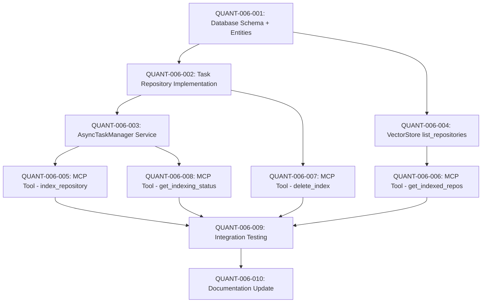

# REQ-006: QUANT TASK DECOMPOSITION

**Requirement**: Ampliar MCP Repo-Indexer con Herramientas de Gestión de Índice  
**Decomposition Date**: 2025-11-25  
**Domain Analysis**: `REQ-006_domain_analysis.md` (pending)

---

## OBJECTIVE

Convertir el MCP server `repo_indexer_mcp.py` de READ-ONLY a CRUD completo, permitiendo gestionar el ciclo de vida del índice (indexar, listar, eliminar, monitorear) directamente desde VS Code Copilot mediante 4 nuevas herramientas MCP.

---

## CENTRAL INVARIANT TO SATISFY

```
∀ repo ∈ indexed_repos: 
  repo.chunks_count > 0 ∧ 
  repo.last_indexed ≤ NOW() ∧
  ∃ task ∈ indexing_tasks: task.repo_name == repo.name → task.status ∈ {completed, failed}

// Translation: Every indexed repository must have chunks, a valid timestamp, 
// and no orphaned "processing" tasks
```

---

## QUANT TASK DEPENDENCY GRAPH



---

## EXECUTION SEQUENCE

**Critical Path**: QUANT-006-001 → QUANT-006-002 → QUANT-006-003 → QUANT-006-005 → QUANT-006-009 → QUANT-006-010 (11h)

**Parallel Opportunities**:
- QUANT-006-004 (VectorStore) can run parallel with QUANT-006-002/003
- QUANT-006-006, 007, 008 (MCP tools) can run parallel after their dependencies

**Total Effort**: 13h  
**Estimated Duration**: 10h (considering parallelism)

### Sequential Order
1. ✅ QUANT-006-001 (2h, LOW risk) - Database Schema + IndexingTask Entity
2. ⏳ QUANT-006-002 (1.5h, LOW risk) - Task Repository Implementation
3. ⏳ QUANT-006-003 (2.5h, MEDIUM risk) - AsyncTaskManager Service [PARALLEL with Q004]
4. ⏳ QUANT-006-004 (1h, LOW risk) - VectorStore list_repositories [PARALLEL with Q002/Q003]
5. ⏳ QUANT-006-005 (1.5h, MEDIUM risk) - MCP Tool: index_repository
6. ⏳ QUANT-006-006 (0.5h, LOW risk) - MCP Tool: get_indexed_repos [PARALLEL with Q007/Q008]
7. ⏳ QUANT-006-007 (0.5h, LOW risk) - MCP Tool: delete_index [PARALLEL with Q006/Q008]
8. ⏳ QUANT-006-008 (0.5h, LOW risk) - MCP Tool: get_indexing_status [PARALLEL with Q006/Q007]
9. ⏳ QUANT-006-009 (2h, HIGH risk) - Integration Testing
10. ⏳ QUANT-006-010 (1h, LOW risk) - Documentation + Copilot Instructions

---

## DETAILED QUANT TASKS

### QUANT-006-001: Create Database Schema + IndexingTask Entity

**Type**: INFRA  
**Layer**: Domain + Infrastructure  
**Bounded Context**: Repository Indexer

**Invariant**:
```
∀ task ∈ indexing_tasks: 
  task.task_id ∈ UUID ∧ 
  task.status ∈ {started, processing, completed, failed} ∧
  (task.status == completed → task.completed_at IS NOT NULL)
```

**Description**:
Crear tabla `indexing_tasks` en PostgreSQL para rastrear el estado de indexación asíncrona, más la entidad inmutable `IndexingTask` y el modelo SQLAlchemy correspondiente.

**Acceptance Criteria**:
- [ ] **AC1**: Tabla `indexing_tasks` existe con columnas requeridas
  - Verification: `docker compose exec indexer-db psql -U indexer -d repo_indexer -c "\d indexing_tasks"`
- [ ] **AC2**: Entidad `IndexingTask` es frozen dataclass con validaciones
  - Verification: `pytest tests/test_indexing_task_entity.py -v`
- [ ] **AC3**: SQLAlchemy model `IndexingTaskModel` mapea correctamente
  - Verification: Query manual retorna objetos válidos

**Dependencies**: `[]`

**Files Affected**:
- `repo_indexer/scripts/init.sql`: CREATE - Agregar definición de tabla + índices
- `repo_indexer/domain/entities/__init__.py`: MODIFY - Agregar `IndexingTask` dataclass
- `repo_indexer/infrastructure/database/models.py`: MODIFY - Agregar `IndexingTaskModel` SQLAlchemy

**Implementation Notes**:
```python
# domain/entities/__init__.py
@dataclass(frozen=True)
class IndexingTask:
    task_id: UUID
    repo_name: str
    repo_path: Path
    status: str  # 'started', 'processing', 'completed', 'failed'
    files_total: Optional[int] = None
    files_processed: int = 0
    chunks_created: int = 0
    started_at: datetime = field(default_factory=datetime.utcnow)
    completed_at: Optional[datetime] = None
    error_message: Optional[str] = None

# infrastructure/database/models.py
class IndexingTaskModel(Base):
    __tablename__ = "indexing_tasks"
    task_id = Column(UUID(as_uuid=True), primary_key=True)
    repo_name = Column(String(255), nullable=False)
    status = Column(String(20), nullable=False)
    # ... (resto de columnas)
```

**Test Strategy**:
Unit test para validar creación de `IndexingTask` con valores por defecto, validación de status enum, conversión desde/hacia SQLAlchemy model.

---

### QUANT-006-002: Implement Task Repository (ITaskRepository)

**Type**: INFRA  
**Layer**: Infrastructure  
**Bounded Context**: Repository Indexer

**Invariant**:
```
∀ operation ∈ {create, get, update, delete}: 
  operation.async == True ∧ 
  operation.return_type == domain.entities.IndexingTask
```

**Description**:
Implementar patrón Repository para gestionar persistencia de `IndexingTask`: crear interfaz abstracta `ITaskRepository` en domain y implementación concreta `TaskRepository` en infrastructure con SQLAlchemy async.

**Acceptance Criteria**:
- [ ] **AC1**: Interfaz `ITaskRepository` define contrato CRUD
  - Verification: `mypy domain/repositories/__init__.py --strict`
- [ ] **AC2**: `TaskRepository` implementa CRUD completo
  - Verification: `pytest tests/test_task_repository.py -v` (>80% coverage)
- [ ] **AC3**: Métodos son 100% async (no blocking calls)
  - Verification: Code review + async detector tool

**Dependencies**: `[QUANT-006-001]`

**Files Affected**:
- `repo_indexer/domain/repositories/__init__.py`: MODIFY - Agregar `ITaskRepository` ABC
- `repo_indexer/infrastructure/database/task_repository.py`: CREATE - Implementar `TaskRepository`

**Implementation Notes**:
```python
# domain/repositories/__init__.py
class ITaskRepository(ABC):
    @abstractmethod
    async def create(self, task: IndexingTask) -> None: pass
    
    @abstractmethod
    async def get_by_id(self, task_id: UUID) -> Optional[IndexingTask]: pass
    
    @abstractmethod
    async def update_status(
        self, task_id: UUID, status: str, **kwargs
    ) -> None: pass
    
    @abstractmethod
    async def get_active_tasks(self, repo_name: str) -> List[IndexingTask]: pass

# infrastructure/database/task_repository.py
class TaskRepository(ITaskRepository):
    def __init__(self, session_factory: async_sessionmaker):
        self._session_factory = session_factory
    
    async def create(self, task: IndexingTask) -> None:
        async with self._session_factory() as session:
            model = IndexingTaskModel(**asdict(task))
            session.add(model)
            await session.commit()
```

**Test Strategy**:
Integration test con test database: crear task → get_by_id → update_status → verificar persistencia. Test edge cases (task no encontrada, concurrent updates).

---

### QUANT-006-003: Build AsyncTaskManager Service

**Type**: INFRA  
**Layer**: Infrastructure (Services)  
**Bounded Context**: Repository Indexer

**Invariant**:
```
∀ task_id ∈ active_tasks: 
  ∃! background_task ∈ asyncio.tasks ∧ 
  task.status ∈ {processing} → background_task.done() == False
```

**Description**:
Crear servicio `AsyncTaskManager` que orquesta indexación en background usando `asyncio.create_task`, actualiza progreso en DB vía `TaskRepository`, y expone métodos para crear/monitorear tareas sin bloquear MCP stdio transport.

**Acceptance Criteria**:
- [ ] **AC1**: `create_task()` retorna task_id inmediatamente (<100ms)
  - Verification: `pytest tests/test_task_manager.py::test_non_blocking_creation -v`
- [ ] **AC2**: Background indexing ejecuta `IndexRepositoryUseCase` completamente
  - Verification: Mock use case, verificar llamadas con argumentos correctos
- [ ] **AC3**: Progreso se actualiza en DB cada N archivos procesados
  - Verification: Query `indexing_tasks` durante ejecución, verificar `files_processed` incrementa

**Dependencies**: `[QUANT-006-002]`

**Files Affected**:
- `repo_indexer/infrastructure/services/task_manager.py`: CREATE - AsyncTaskManager class
- `repo_indexer/application/index_repository.py`: MODIFY - Agregar progress callbacks

**Implementation Notes**:
```python
# infrastructure/services/task_manager.py
class AsyncTaskManager:
    def __init__(self, task_repo: ITaskRepository):
        self._task_repo = task_repo
        self._active_tasks: dict[str, asyncio.Task] = {}
    
    async def create_task(
        self, 
        repo_name: str, 
        repo_path: Path,
        use_case: IndexRepositoryUseCase
    ) -> str:
        task_id = str(uuid4())
        task = IndexingTask(
            task_id=UUID(task_id),
            repo_name=repo_name,
            repo_path=repo_path,
            status="started"
        )
        await self._task_repo.create(task)
        
        # Non-blocking background execution
        bg_task = asyncio.create_task(
            self._run_indexing(task_id, repo_name, repo_path, use_case)
        )
        self._active_tasks[task_id] = bg_task
        
        return task_id
    
    async def _run_indexing(
        self, 
        task_id: str, 
        repo_name: str, 
        repo_path: Path,
        use_case: IndexRepositoryUseCase
    ):
        try:
            await self._task_repo.update_status(
                UUID(task_id), "processing"
            )
            
            # Execute with progress callback
            stats = await use_case.execute(
                repo_path, 
                repo_name,
                progress_callback=lambda p: self._update_progress(task_id, p)
            )
            
            await self._task_repo.update_status(
                UUID(task_id), 
                "completed",
                chunks_created=stats["chunks_indexed"],
                completed_at=datetime.utcnow()
            )
        except Exception as e:
            await self._task_repo.update_status(
                UUID(task_id), 
                "failed",
                error_message=str(e)
            )
    
    async def _update_progress(self, task_id: str, progress: dict):
        await self._task_repo.update_status(
            UUID(task_id),
            "processing",
            files_processed=progress["files_processed"],
            files_total=progress["files_total"]
        )
    
    async def get_status(self, task_id: str) -> dict:
        task = await self._task_repo.get_by_id(UUID(task_id))
        if not task:
            raise ValueError(f"Task {task_id} not found")
        
        return {
            "task_id": task_id,
            "status": task.status,
            "progress": {
                "files_indexed": task.files_processed,
                "total_files": task.files_total,
                "chunks_created": task.chunks_created
            },
            "errors": [task.error_message] if task.error_message else []
        }
```

**Test Strategy**:
Mock `IndexRepositoryUseCase`, crear task, verificar que background task se ejecuta sin bloquear, verificar actualizaciones de progreso en DB, test error handling (exception en use case).

---

### QUANT-006-004: Add list_repositories() to PostgresVectorStore

**Type**: INFRA  
**Layer**: Infrastructure (Database)  
**Bounded Context**: Repository Indexer

**Invariant**:
```
∀ repo ∈ list_repositories().result: 
  repo.chunk_count == COUNT(*) FROM code_chunks WHERE repo_name = repo.name ∧
  repo.last_indexed == MAX(indexed_at) FROM code_chunks WHERE repo_name = repo.name
```

**Description**:
Agregar método `list_repositories()` a `PostgresVectorStore` que retorna estadísticas agregadas (nombre, chunk_count, last_indexed, file_count, avg_chunk_size) de todos los repos indexados mediante query SQL optimizada.

**Acceptance Criteria**:
- [ ] **AC1**: Método retorna lista de dicts con estructura definida
  - Verification: `pytest tests/test_vector_store.py::test_list_repositories -v`
- [ ] **AC2**: Query usa GROUP BY para evitar N+1 queries
  - Verification: EXPLAIN ANALYZE de la query, verificar single query
- [ ] **AC3**: Repositorios sin chunks NO aparecen en resultado
  - Verification: Test con repo vacío, verificar no está en lista

**Dependencies**: `[QUANT-006-001]` (independiente de task repo)

**Files Affected**:
- `repo_indexer/infrastructure/database/vector_store.py`: MODIFY - Agregar `list_repositories()`

**Implementation Notes**:
```python
# infrastructure/database/vector_store.py
class PostgresVectorStore(IVectorStore):
    async def list_repositories(self) -> list[dict]:
        """List all indexed repositories with statistics."""
        async with self._session_factory() as session:
            query = select(
                CodeChunkModel.repo_name,
                func.count(CodeChunkModel.id).label("chunk_count"),
                func.max(CodeChunkModel.indexed_at).label("last_indexed"),
                func.count(func.distinct(CodeChunkModel.file_path)).label("file_count"),
                func.avg(func.length(CodeChunkModel.content)).label("avg_chunk_size")
            ).group_by(CodeChunkModel.repo_name)
            
            result = await session.execute(query)
            rows = result.all()
            
            return [
                {
                    "repo_name": row.repo_name,
                    "chunk_count": row.chunk_count,
                    "last_indexed": row.last_indexed.isoformat(),
                    "file_count": row.file_count,
                    "avg_chunk_size": int(row.avg_chunk_size) if row.avg_chunk_size else 0
                }
                for row in rows
            ]
```

**Test Strategy**:
Integration test: indexar 2 repos con diferentes cantidades de chunks, llamar `list_repositories()`, verificar stats correctas para cada repo.

---

### QUANT-006-005: MCP Tool - index_repository

**Type**: API  
**Layer**: API (MCP Server)  
**Bounded Context**: Repository Indexer

**Invariant**:
```
∀ call ∈ index_repository_calls: 
  response.task_id ∈ UUID ∧ 
  response.status == "started" ∧ 
  response_time < 500ms
```

**Description**:
Implementar herramienta MCP `@mcp.tool async def index_repository()` que valida argumentos (repo_path existe, repo_name válido), delega a `AsyncTaskManager.create_task()`, y retorna task_id inmediatamente sin bloquear.

**Acceptance Criteria**:
- [ ] **AC1**: Tool aparece en MCP Inspector con schema correcto
  - Verification: `uv run mcp dev mcp_servers/repo_indexer_mcp.py` → verificar tool visible
- [ ] **AC2**: Llamada retorna task_id y status="started" en <500ms
  - Verification: MCP client test con timer
- [ ] **AC3**: Manejo de errores (path inválido, permisos)
  - Verification: Test con path inexistente, verificar ToolError descriptivo

**Dependencies**: `[QUANT-006-003]`

**Files Affected**:
- `sia/mcp_servers/repo_indexer_mcp.py`: MODIFY - Agregar `@mcp.tool index_repository()`

**Implementation Notes**:
```python
# mcp_servers/repo_indexer_mcp.py
@mcp.tool
async def index_repository(
    repo_path: str,
    repo_name: str,
    force_reindex: bool = False
) -> dict:
    """
    Index or re-index a repository.
    
    Args:
        repo_path: Absolute path to repository (e.g., /Users/.../sia)
        repo_name: Identifier for search (e.g., "sia")
        force_reindex: If True, delete existing index first
    
    Returns:
        {
            "task_id": "uuid",
            "status": "started",
            "repo_name": "sia",
            "estimated_files": 120
        }
    """
    from pathlib import Path
    
    # Validate input
    path = Path(repo_path)
    if not path.exists():
        raise ToolError(f"Repository path does not exist: {repo_path}")
    if not path.is_dir():
        raise ToolError(f"Path is not a directory: {repo_path}")
    
    # Delete existing if force_reindex
    if force_reindex:
        # Call delete_index tool internally
        await delete_index(repo_name)
    
    # Create indexing task
    task_id = await task_manager.create_task(
        repo_name=repo_name,
        repo_path=path,
        use_case=index_use_case  # From lifespan context
    )
    
    # Estimate files (quick scan)
    estimated_files = len(list(path.rglob("*.py")))
    
    return {
        "task_id": task_id,
        "status": "started",
        "repo_name": repo_name,
        "estimated_files": estimated_files
    }
```

**Test Strategy**:
Mock `AsyncTaskManager`, llamar tool con path válido, verificar task_id retornado, verificar llamada a task_manager con argumentos correctos. Test error cases (path inválido).

---

### QUANT-006-006: MCP Tool - get_indexed_repos

**Type**: API  
**Layer**: API (MCP Server)  
**Bounded Context**: Repository Indexer

**Invariant**:
```
∀ repo ∈ get_indexed_repos().result: 
  repo.chunk_count > 0
```

**Description**:
Implementar herramienta MCP `@mcp.tool async def get_indexed_repos()` que delega a `vector_store.list_repositories()` y retorna lista de repos con estadísticas.

**Acceptance Criteria**:
- [ ] **AC1**: Tool retorna array de dicts con estructura correcta
  - Verification: MCP Inspector + manual call, verificar schema
- [ ] **AC2**: Repos sin chunks NO aparecen en resultado
  - Verification: Test con DB vacía, verificar array vacío
- [ ] **AC3**: Response time < 200ms (query optimizada)
  - Verification: Performance test con 5 repos indexados

**Dependencies**: `[QUANT-006-004]`

**Files Affected**:
- `sia/mcp_servers/repo_indexer_mcp.py`: MODIFY - Agregar `@mcp.tool get_indexed_repos()`

**Implementation Notes**:
```python
@mcp.tool
async def get_indexed_repos() -> list[dict]:
    """
    List all indexed repositories with statistics.
    
    Returns:
        [
            {
                "repo_name": "sia",
                "chunk_count": 587,
                "last_indexed": "2025-11-25T10:30:00Z",
                "file_count": 120,
                "avg_chunk_size": 450
            }
        ]
    """
    repos = await vector_store.list_repositories()
    return repos
```

**Test Strategy**:
Integration test: indexar 2 repos, llamar tool, verificar ambos aparecen con stats correctas. Test con DB vacía retorna array vacío.

---

### QUANT-006-007: MCP Tool - delete_index

**Type**: API  
**Layer**: API (MCP Server)  
**Bounded Context**: Repository Indexer

**Invariant**:
```
∀ call ∈ delete_index_calls: 
  POST(call) → COUNT(*) FROM code_chunks WHERE repo_name = call.repo_name == 0
```

**Description**:
Implementar herramienta MCP `@mcp.tool async def delete_index()` que elimina todos los chunks y file_metadata de un repositorio, retorna contadores de elementos eliminados.

**Acceptance Criteria**:
- [ ] **AC1**: Elimina chunks y file_metadata atomically (transaction)
  - Verification: Test con rollback, verificar integridad
- [ ] **AC2**: Retorna contadores de elementos eliminados
  - Verification: Indexar repo, deletar, verificar counts correctos
- [ ] **AC3**: No falla si repo no existe (idempotent)
  - Verification: Llamar delete 2 veces, verificar no error

**Dependencies**: `[QUANT-006-001]` (necesita DB schema)

**Files Affected**:
- `sia/mcp_servers/repo_indexer_mcp.py`: MODIFY - Agregar `@mcp.tool delete_index()`

**Implementation Notes**:
```python
@mcp.tool
async def delete_index(repo_name: str) -> dict:
    """
    Delete all indexed data for a repository.
    
    Args:
        repo_name: Repository identifier
    
    Returns:
        {
            "repo_name": "sia",
            "chunks_deleted": 587,
            "files_deleted": 120
        }
    """
    from sqlalchemy import delete
    from infrastructure.database.models import CodeChunkModel, FileMetadataModel
    
    async with AsyncSessionLocal() as session:
        async with session.begin():
            # Delete chunks
            chunks_result = await session.execute(
                delete(CodeChunkModel).where(
                    CodeChunkModel.repo_name == repo_name
                )
            )
            
            # Delete file metadata
            files_result = await session.execute(
                delete(FileMetadataModel).where(
                    FileMetadataModel.repo_name == repo_name
                )
            )
    
    return {
        "repo_name": repo_name,
        "chunks_deleted": chunks_result.rowcount,
        "files_deleted": files_result.rowcount
    }
```

**Test Strategy**:
Integration test: indexar repo, llamar delete_index, verificar chunks/files eliminados, verificar get_indexed_repos no lo muestra. Test idempotence (llamar 2 veces).

---

### QUANT-006-008: MCP Tool - get_indexing_status

**Type**: API  
**Layer**: API (MCP Server)  
**Bounded Context**: Repository Indexer

**Invariant**:
```
∀ task_id ∈ valid_tasks: 
  get_indexing_status(task_id).status ∈ {started, processing, completed, failed}
```

**Description**:
Implementar herramienta MCP `@mcp.tool async def get_indexing_status()` que delega a `task_manager.get_status()` y retorna estado de tarea de indexación con progreso.

**Acceptance Criteria**:
- [ ] **AC1**: Retorna estructura con task_id, status, progress
  - Verification: Mock task manager, verificar schema response
- [ ] **AC2**: Levanta ToolError si task_id no existe
  - Verification: Test con UUID random, verificar error descriptivo
- [ ] **AC3**: Response time < 100ms (query by primary key)
  - Verification: Performance test

**Dependencies**: `[QUANT-006-003]`

**Files Affected**:
- `sia/mcp_servers/repo_indexer_mcp.py`: MODIFY - Agregar `@mcp.tool get_indexing_status()`

**Implementation Notes**:
```python
@mcp.tool
async def get_indexing_status(task_id: str) -> dict:
    """
    Check status of async indexing task.
    
    Args:
        task_id: Task identifier from index_repository
    
    Returns:
        {
            "task_id": "abc-123",
            "status": "processing",
            "progress": {
                "files_indexed": 45,
                "total_files": 120,
                "chunks_created": 234,
                "estimated_time_remaining": 30
            },
            "errors": []
        }
    """
    try:
        status = await task_manager.get_status(task_id)
        return status
    except ValueError as e:
        raise ToolError(str(e))
```

**Test Strategy**:
Mock task manager, test con task existente (verificar retorno correcto), test con task inexistente (verificar ToolError). Integration test con tarea real en progreso.

---

### QUANT-006-009: Integration Testing (End-to-End Workflow)

**Type**: TEST  
**Layer**: All Layers  
**Bounded Context**: Repository Indexer

**Invariant**:
```
test_workflow: 
  index_repository → get_indexing_status (loop until completed) → 
  get_indexed_repos (verify present) → search_code (verify results) → 
  delete_index → get_indexed_repos (verify absent)
```

**Description**:
Crear suite de integration tests que valida el flujo completo: indexar repo → monitorear progreso → buscar → eliminar, usando test database real y repo de prueba (fixture con código Python simple).

**Acceptance Criteria**:
- [ ] **AC1**: Test end-to-end pasa en <2min con repo pequeño (10 files)
  - Verification: `pytest tests/integration/test_mcp_indexing.py -v`
- [ ] **AC2**: Test valida todos los estados de la máquina de estados
  - Verification: Verificar coverage incluye started → processing → completed
- [ ] **AC3**: Test cleanup (delete) garantiza estado limpio
  - Verification: Test puede ejecutarse múltiples veces sin conflictos

**Dependencies**: `[QUANT-006-005, QUANT-006-006, QUANT-006-007, QUANT-006-008]`

**Files Affected**:
- `repo_indexer/tests/integration/test_mcp_indexing.py`: CREATE - Integration test suite
- `repo_indexer/tests/fixtures/sample_repo/`: CREATE - Test repository with Python files

**Implementation Notes**:
```python
# tests/integration/test_mcp_indexing.py
import pytest
from pathlib import Path
import asyncio

@pytest.mark.asyncio
async def test_end_to_end_indexing_workflow(mcp_client, sample_repo_path):
    """Test complete MCP indexing workflow."""
    
    # Step 1: Verify repo not indexed
    repos = await mcp_client.call_tool("get_indexed_repos", {})
    assert not any(r["repo_name"] == "test_repo" for r in repos)
    
    # Step 2: Start indexing
    result = await mcp_client.call_tool("index_repository", {
        "repo_path": str(sample_repo_path),
        "repo_name": "test_repo"
    })
    task_id = result["task_id"]
    assert result["status"] == "started"
    
    # Step 3: Monitor progress
    for _ in range(30):  # Max 30s
        status = await mcp_client.call_tool("get_indexing_status", {
            "task_id": task_id
        })
        if status["status"] == "completed":
            break
        await asyncio.sleep(1)
    
    assert status["status"] == "completed"
    assert status["progress"]["chunks_created"] > 0
    
    # Step 4: Verify indexed
    repos = await mcp_client.call_tool("get_indexed_repos", {})
    test_repo = next((r for r in repos if r["repo_name"] == "test_repo"), None)
    assert test_repo is not None
    assert test_repo["chunk_count"] > 0
    
    # Step 5: Semantic search works
    search_results = await mcp_client.call_tool("search_code", {
        "repo_name": "test_repo",
        "query": "function definition"
    })
    assert len(search_results) > 0
    
    # Step 6: Cleanup
    delete_result = await mcp_client.call_tool("delete_index", {
        "repo_name": "test_repo"
    })
    assert delete_result["chunks_deleted"] > 0
    
    # Step 7: Verify deleted
    repos = await mcp_client.call_tool("get_indexed_repos", {})
    assert not any(r["repo_name"] == "test_repo" for r in repos)

@pytest.mark.asyncio
async def test_force_reindex():
    """Test force_reindex flag deletes existing before re-indexing."""
    # First indexing
    result1 = await mcp_client.call_tool("index_repository", {
        "repo_path": str(sample_repo_path),
        "repo_name": "test_repo"
    })
    # Wait for completion...
    
    # Force re-index
    result2 = await mcp_client.call_tool("index_repository", {
        "repo_path": str(sample_repo_path),
        "repo_name": "test_repo",
        "force_reindex": True
    })
    # Verify old data deleted, new indexing started

@pytest.mark.asyncio
async def test_invalid_repo_path():
    """Test error handling for non-existent path."""
    with pytest.raises(ToolError, match="does not exist"):
        await mcp_client.call_tool("index_repository", {
            "repo_path": "/nonexistent/path",
            "repo_name": "fake_repo"
        })
```

**Test Strategy**:
Fixture `sample_repo_path` crea directorio temporal con 10 archivos .py (funciones, clases, imports). Test limpia DB antes/después. Validar todos los transitions de estado de tarea.

---

### QUANT-006-010: Documentation + Copilot Instructions Update

**Type**: DEPLOY  
**Layer**: Documentation  
**Bounded Context**: SIA Framework

**Invariant**:
```
copilot_instructions.contains("mcp_repo-indexer_index_repository") ∧ 
copilot_instructions.NOT_contains("cd /path && uv run repo-indexer index")
```

**Description**:
Actualizar documentación en SIA (`copilot-instructions.md`) eliminando referencias a CLI manual de repo-indexer, reemplazando con ejemplos de uso de herramientas MCP. Actualizar `mcp_servers/README.md` con nuevas capacidades.

**Acceptance Criteria**:
- [ ] **AC1**: `copilot-instructions.md` muestra workflow MCP completo
  - Verification: Grep "index_repository", verificar presente; grep "uv run repo-indexer index", verificar ausente
- [ ] **AC2**: `mcp_servers/README.md` documenta 4 nuevas tools con ejemplos
  - Verification: Manual review, verificar schema y ejemplos correctos
- [ ] **AC3**: `REQ-006/VALIDATION.md` creado con checklist de validación
  - Verification: Archivo existe con criterios de aceptación REQ-006

**Dependencies**: `[QUANT-006-009]`

**Files Affected**:
- `sia/.github/copilot-instructions.md`: MODIFY - Reemplazar sección "Repository Initialization Protocol"
- `sia/mcp_servers/README.md`: MODIFY - Agregar sección "Index Management Tools"
- `sia/requirements/REQ-006/VALIDATION.md`: CREATE - Validation checklist

**Implementation Notes**:
```markdown
<!-- sia/.github/copilot-instructions.md -->
### Repository Initialization Protocol

**Super Agent can now manage the knowledge graph via MCP (no CLI needed):**

```python
# Step 1: Check indexing status
repos = mcp_repo-indexer_get_indexed_repos()

# Step 2: If repo not indexed
if "sia" not in [r["repo_name"] for r in repos]:
    # Auto-index
    result = mcp_repo-indexer_index_repository(
        repo_path="/Users/gpilleux/apps/meineapps/sia",
        repo_name="sia"
    )
    
    # Monitor progress (non-blocking)
    task_id = result["task_id"]
    status = mcp_repo-indexer_get_indexing_status(task_id)
    
    # Wait for completion (loop with sleep)
    while status["status"] in ["started", "processing"]:
        await asyncio.sleep(2)
        status = mcp_repo-indexer_get_indexing_status(task_id)
    
    if status["status"] == "completed":
        print(f"✅ Indexed {status['progress']['chunks_created']} chunks")

# Step 3: Search when ready
results = mcp_repo-indexer_search_code("sia", "auto discovery pattern")
```

**Management Commands:**
- `mcp_repo-indexer_index_repository(repo_path, repo_name, force_reindex=False)` - Index/re-index
- `mcp_repo-indexer_get_indexed_repos()` - List all with stats
- `mcp_repo-indexer_delete_index(repo_name)` - Remove index
- `mcp_repo-indexer_get_indexing_status(task_id)` - Check progress
```

**Test Strategy**:
Manual review de documentación, ejecutar copilot con nuevo workflow, validar que no menciona CLI manual.

---

## RISK MITIGATION STRATEGIES

### High-Risk Tasks
- **QUANT-006-003** (AsyncTaskManager): Validar non-blocking behavior con timeouts estrictos en tests
- **QUANT-006-009** (Integration Testing): Usar repo pequeño (<10 files) para evitar timeouts, fixtures con cleanup garantizado

### Dependencies on External Systems
- Docker database debe estar running (verificar en setup de tests)
- Google Gemini API key válida (mock en unit tests, real en integration)

### Validation Points
- Después de QUANT-006-003: Validar que MCP stdio no se bloquea (timeout test)
- Después de QUANT-006-005: Validar con MCP Inspector antes de continuar
- Después de QUANT-006-009: Full regression test de funcionalidad existente (search_code)

---

## COMPLETION CHECKLIST

- [ ] Todos los QUANT tasks tienen status ✅
- [ ] Integration tests pasan en CI/CD
- [ ] Copilot instructions actualizadas y validadas
- [ ] `mcp_repo-indexer_get_indexed_repos()` retorna al menos 1 repo (sia)
- [ ] Semantic search post-indexing retorna resultados relevantes
- [ ] No CLI commands en copilot-instructions.md
- [ ] REQ-006 marcado como COMPLETED en `REQUIREMENTS_TRACKING.md`

---

**Total QUANT Tasks**: 10  
**Estimated Completion**: 2025-11-26 (1-2 days of focused work)  
**Test Coverage Target**: >80% for new code  
**Performance Targets**: 
- index_repository response: <500ms
- get_indexed_repos response: <200ms
- Background indexing: >20 files/sec
