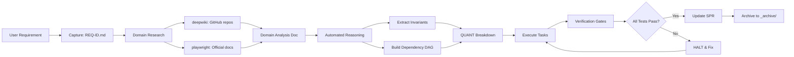

# REQUIREMENTS MANAGEMENT SYSTEM

## MISSION

System for **architectural self-evolution** based on:
- **Automated Reasoning** (formal reasoning, mathematical invariants)
- **Domain Research First** (deepwiki, playwright, official docs)
- **QUANT Decomposition** (atomic, verifiable, ordered tasks)
- **Principles**: DDD, SOLID, KISS, Clean Code

---

## WORKFLOW



---

## DIRECTORY STRUCTURE

```
requirements/
├── README.md                          # This file
├── _templates/                        # Reusable templates
│   ├── REQUIREMENT_TEMPLATE.md        # Initial capture
│   ├── DOMAIN_ANALYSIS_TEMPLATE.md    # Research
│   └── QUANT_BREAKDOWN_TEMPLATE.md    # Decomposition
├── _archive/                          # Completed requirements
│   └── REQ-001/                       # Example archived req
│       ├── REQ-001.md
│       ├── REQ-001_domain_analysis.md
│       └── REQ-001_quant_breakdown.md
└── REQ-{ID}/                          # Active requirement
    ├── REQ-{ID}.md                    # Specification
    ├── REQ-{ID}_domain_analysis.md    # Research
    └── REQ-{ID}_quant_breakdown.md    # QUANT Tasks
```

---

## PHASE 1: CAPTURE

### Input: Natural Language
**User provides requirements as natural conversation**:
- Casual observations: "It would be good to have auth"
- Vague ideas: "I need to visualize data better"
- Reported problems: "Chat is slow"

### Agent Translation Process
Agent autonomously extracts and structures:

1. **Problem Identification**: What is the reported problem?
2. **Invariant Extraction**: What must be true when resolved?
3. **Context Discovery**: Which bounded contexts are affected?
4. **Acceptance Formalization**: How do we verify DONE?
5. **Research Scoping**: What needs research?

### Action
Agent creates `requirements/REQ-{ID}/REQ-{ID}.md` using `_templates/REQUIREMENT_TEMPLATE.md`

---

## PHASE 2: DOMAIN RESEARCH

### Action
Create `requirements/REQ-{ID}/REQ-{ID}_domain_analysis.md` using `_templates/DOMAIN_ANALYSIS_TEMPLATE.md`

### Tools

#### deepwiki (MCP Tool)
**Use**: Research GitHub repos for implementation patterns.
```bash
mcp_deepwiki_ask_question(
    repoName="owner/repo",
    question="How to implement X with Y?"
)
```

#### playwright (MCP Tool)
**Use**: Navigate official docs, extract specs.
```bash
mcp_playwright_browser_navigate(url="https://docs.example.com")
```

### Principles
- ✅ **Research First**: DO NOT implement without research.
- ✅ **Evidence-Based**: Decisions based on real code, not intuition.
- ✅ **Principle-Driven**: Justify with DDD/SOLID/KISS.

---

## PHASE 3: AUTOMATED REASONING

### Action
Apply **automated_reasoning** to extract invariants and formalize problem.

### Process
1. **Formalize Problem**: `∀ message ∈ session: message.session_id == session.id`
2. **Extract Invariants**: Mathematical constraints.
3. **Identify Axioms**: What is assumed true?
4. **Build Dependency DAG**: Entity → Repo → Migration → Test.
5. **Generate Theorems** (QUANT tasks).

---

## PHASE 4: QUANT DECOMPOSITION

### Action
Create `requirements/REQ-{ID}/REQ-{ID}_quant_breakdown.md` using `_templates/QUANT_BREAKDOWN_TEMPLATE.md`

### Pre-Decomposition Skills Validation
**BEFORE creating QUANT tasks**, execute architectural validation skills:

```bash
# Skill 1: Architecture Baseline
sh sia/skills/visualize_architecture.sh

# Skill 2: Complexity Baseline
sh sia/skills/check_complexity.sh

# Skill 3: Coverage Baseline
sh sia/skills/check_coverage.sh
```

**Rationale**: Skills provide **objective data** to prioritize QUANT tasks.

### QUANT Task Criteria
**Atomic**: Indivisible.
**Quantifiable**: Binary state (DONE/NOT_DONE).
**Testable**: Executable acceptance criteria.
**Ordered**: Dependency DAG.
**Traceable**: Maps to domain invariant.

---

## PHASE 5: EXECUTION

### Workflow per Task
1. **Mark In-Progress**.
2. **Implement**.
3. **Test**.
4. **Verify Invariant**.
5. **Check Regression**.
6. **Commit**.
7. **Mark Done**.
