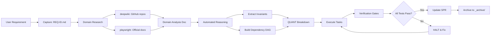

# REQUIREMENTS MANAGEMENT SYSTEM

## MISSION

System for **architectural self-evolution** based on:
- **Automated Reasoning** (formal reasoning, mathematical invariants)
- **Domain Research First** (deepwiki, playwright, official docs)
- **QUANT Decomposition** (atomic, verifiable, ordered tasks)
- **Principles**: DDD, SOLID, KISS, Clean Code

---

## WORKFLOW


```mermaid
graph LR
    A[User Requirement] --> B[Capture: REQ-ID.md]
    B --> C[Domain Research]
    C --> D[deepwiki: GitHub repos]
    C --> E[playwright: Official docs]
    D --> F[Domain Analysis Doc]
    E --> F
    F --> G[Automated Reasoning]
    G --> H[Extract Invariants]
    G --> I[Build Dependency DAG]
    H --> J[QUANT Breakdown]
    I --> J
    J --> K[Execute Tasks]
    K --> L[Verification Gates]
    L --> M{All Tests Pass?}
    M -->|Yes| N[Update SPR]
    M -->|No| O[HALT & Fix]
    O --> K
    N --> P[Archive to _archive/]
```

---

## DIRECTORY STRUCTURE

```
requirements/
├── README.md                          # This file
├── _templates/                        # Reusable templates
│   ├── REQUIREMENT_TEMPLATE.md        # Initial capture
│   ├── DOMAIN_ANALYSIS_TEMPLATE.md    # Research
│   └── QUANT_BREAKDOWN_TEMPLATE.md    # Decomposition
├── _archive/                          # Completed requirements
│   └── REQ-001/                       # Example archived req
│       ├── REQ-001.md
│       ├── REQ-001_domain_analysis.md
│       └── REQ-001_quant_breakdown.md
└── REQ-{ID}/                          # Active requirement
    ├── REQ-{ID}.md                    # Specification
    ├── REQ-{ID}_domain_analysis.md    # Research
    └── REQ-{ID}_quant_breakdown.md    # QUANT Tasks
```

---

## PHASE 1: CAPTURE

### Input: Natural Language
**User provides requirements as natural conversation**:
- Casual observations: "It would be good to have auth"
- Vague ideas: "I need to visualize data better"
- Reported problems: "Chat is slow"

### Agent Translation Process
Agent autonomously extracts and structures:

1. **Problem Identification**: What is the reported problem?
2. **Invariant Extraction**: What must be true when resolved?
3. **Context Discovery**: Which bounded contexts are affected?
4. **Acceptance Formalization**: How do we verify DONE?
5. **Research Scoping**: What needs research?

### Action
Agent creates `requirements/REQ-{ID}/REQ-{ID}.md` using `_templates/REQUIREMENT_TEMPLATE.md`

---

## PHASE 2: DOMAIN RESEARCH

### Action
Create `requirements/REQ-{ID}/REQ-{ID}_domain_analysis.md` using `_templates/DOMAIN_ANALYSIS_TEMPLATE.md`

### Tools

#### deepwiki (MCP Tool)
**Use**: Research GitHub repos for implementation patterns.
```bash
mcp_deepwiki_ask_question(
    repoName="owner/repo",
    question="How to implement X with Y?"
)
```

#### playwright (MCP Tool)
**Use**: Navigate official docs, extract specs.
```bash
mcp_playwright_browser_navigate(url="https://docs.example.com")
```

### Principles
- ✅ **Research First**: DO NOT implement without research.
- ✅ **Evidence-Based**: Decisions based on real code, not intuition.
- ✅ **Principle-Driven**: Justify with DDD/SOLID/KISS.

---

## PHASE 3: AUTOMATED REASONING

### Action
Apply **First Principles Analysis** followed by **automated_reasoning** to extract invariants and formalize problem.

### Process

#### Step 1: First Principles Analysis (MANDATORY)
**Question Protocol**:
```markdown
1. WHAT are we trying to achieve fundamentally?
   → Strip away inherited assumptions, get to core problem

2. WHY is this the goal? (Recursive until axiom)
   → "To improve UX" → Why? → "Faster response" → Why? → AXIOM: Users tolerate <200ms

3. WHAT do we know is fundamentally true?
   → List axioms (self-evident, irreducible, independent)

4. WHAT are we assuming?
   → Identify inherited beliefs, mark for elimination

5. HOW do we rebuild from axioms?
   → Derive solution from fundamental truths
```

**Example**:
```markdown
Feature: "Add caching to API"

❌ Conventional: "Use Redis because it's standard"

✅ First Principles:
Q: What's fundamentally true?
AXIOM 1: Users tolerate <200ms latency
AXIOM 2: Data changes infrequently (hourly updates)
AXIOM 3: Simplest solution that works (KISS)

Q: What are we assuming?
❌ ASSUMPTION: Caching is needed
❌ ASSUMPTION: Redis is the solution

Q: What are the facts?
MEASUREMENT: API response 2s (1.8s DB query + 0.2s serialization)
FACT: Query scans 1M rows (missing index)
FACT: 90% of queries request same 100 records

Q: Rebuild from axioms:
OPTION 1: Add database index
  - Cost: 5 min, Impact: 1.8s → 0.05s, Complexity: Zero
  - JUSTIFIED: ✅ (simplest, biggest impact)

OPTION 2: Redis cache
  - Cost: New infra, Impact: 1.8s → 0.01s, Complexity: High
  - JUSTIFIED: ❌ (unjustified complexity vs index)

DECISION: Database index (First Principles: Simplest solution)
DEFER: Redis only if horizontal scaling requires distributed cache
```

#### Step 2: Automated Reasoning (Extract Invariants)
Once axioms identified, derive mathematical constraints:

1. **Formalize Problem**: `∀ message ∈ session: message.session_id == session.id`
2. **Extract Invariants**: Mathematical constraints from axioms.
3. **Identify Axioms**: What is assumed true? (from Step 1)
4. **Build Dependency DAG**: Entity → Repo → Migration → Test.
5. **Generate Theorems** (QUANT tasks).

**Example** (continuing from above):
```markdown
AXIOM: Query latency < 200ms (from First Principles)

INVARIANTS (derived):
INV-1: ∀ user_query: execution_time(query) < 200ms
INV-2: ∀ index: selectivity(index) > 0.1 ⇒ justified
INV-3: ∀ optimization: complexity_cost < performance_gain

DEPENDENCY DAG:
1. Create index migration
2. Validate index usage (EXPLAIN ANALYZE)
3. Test latency invariant (<200ms)
4. Document decision (ADR with First Principles justification)
```

### Integration with Skills
**Before Automated Reasoning**, baseline the system:
```bash
# Complexity baseline (identify refactor targets)
sh sia/skills/check_complexity.sh

# Architecture baseline (validate DDD compliance)
sh sia/skills/visualize_architecture.sh

# Coverage baseline (identify test gaps)
sh sia/skills/check_coverage.sh
```

**Skills provide objective data** for First Principles analysis (facts, not assumptions).

---

## PHASE 4: QUANT DECOMPOSITION

### Action
Create `requirements/REQ-{ID}/REQ-{ID}_quant_breakdown.md` using `_templates/QUANT_BREAKDOWN_TEMPLATE.md`

### Pre-Decomposition Skills Validation
**BEFORE creating QUANT tasks**, execute architectural validation skills:

```bash
# Skill 1: Architecture Baseline
sh sia/skills/visualize_architecture.sh

# Skill 2: Complexity Baseline
sh sia/skills/check_complexity.sh

# Skill 3: Coverage Baseline
sh sia/skills/check_coverage.sh
```

**Rationale**: Skills provide **objective data** to prioritize QUANT tasks.

### Human vs AI Estimation (Task Timer)
During QUANT breakdown, Super Agent provides **two estimates** for each task:

1. **AI Estimate**: How long Super Agent predicts it will take itself
2. **Human Estimate**: How long a human dev team would take (research + implementation + testing + review + overhead)

**Example QUANT Task**:
```markdown
## QUANT-040: Chat UIResourceRenderer Integration
**Estimated Duration**:
- AI: 3h (SSE integration + testing + docs)
- Human Team: 12h (research 2h + implementation 4h + testing 3h + code review 1.5h + overhead 1.5h)
```

**Rationale**: Human estimates enable ROI calculation (AI speedup metrics).

### QUANT Task Criteria
**Atomic**: Indivisible.
**Quantifiable**: Binary state (DONE/NOT_DONE).
**Testable**: Executable acceptance criteria.
**Ordered**: Dependency DAG.
**Traceable**: Maps to domain invariant.

---

## PHASE 5: EXECUTION

### Workflow per Task
1. **Mark In-Progress**.
2. **Start Timer** (with AI estimate from breakdown).
   ```bash
   uv run sia/skills/task_timer.py start QUANT-040 3 "Task description"
   ```
3. **Implement**.
4. **Test**.
5. **Verify Invariant**.
6. **Check Regression**.
7. **Stop Timer** (with Human estimate from breakdown).
   ```bash
   uv run sia/skills/task_timer.py stop --human-hours 12
   ```
8. **Commit**.
9. **Mark Done**.

### Task Timer Metrics
Timer tracks:
- **AI Performance**: Estimated vs Actual duration, variance percentage, correction factor
- **Human Comparison**: AI speedup (e.g., 4.4x faster), time saved
- **Prediction Quality**: Historical variance, best/worst predictions, actionable insights

View metrics: `uv run sia/skills/task_timer.py metrics`
