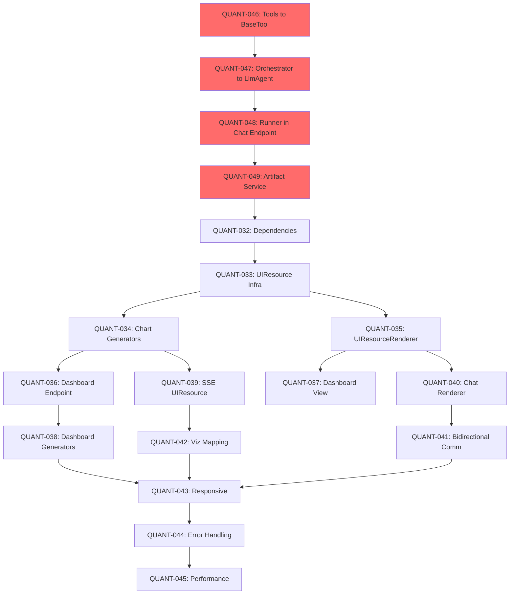
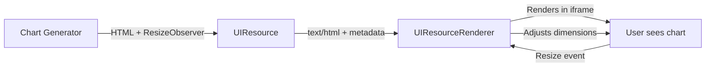

# REQ-003: QUANT Breakdown - Dynamic UI Rendering System

**Breakdown Date**: 2025-11-24 (Updated)  
**Total Tasks**: 18 (4 ADK Migration + 14 MCP-UI Integration)  
**Estimated Duration**: 55 hours (~7 days)  
**Status**: IN PROGRESS (33% complete)

**Progress Summary**:
- ✅ PHASE 0: ADK Migration (100% - 4/4 tasks)
- ✅ PHASE 1: MCP-UI Foundation (100% - 4/4 tasks)
- ⏳ PHASE 2: Dashboard (33% - 1/3 tasks)
- ⏳ PHASE 3: Chat Integration (0% - 0/4 tasks)
- ⏳ PHASE 4: Polish (0% - 0/3 tasks)

**Next**: QUANT-037 (Frontend Dashboard View)

---

## ⚠️ CRITICAL DISCOVERY: ADK Migration Prerequisite

**Investigation Result**: El sistema actual NO usa Google ADK Runner en producción.

**Estado Real**:
- ✅ ADK agents implementados como boilerplate (`infrastructure/adk/agents/`)
- ✅ `PostgresAdkSessionService` existe y funciona en demos
- ❌ **Chat endpoint usa orquestación custom** (`execute_multi_agent_workflow()`)
- ❌ **No hay `Runner.run_async()` en producción** → No hay ADK Artifact Service

**Implicación**: MCP-UI `UIResource` depende de `google.genai.types.Part` artifacts, que solo están disponibles vía ADK Artifact Service.

**Decisión**: Agregar **PHASE 0** para migrar a Google ADK Runner ANTES de implementar MCP-UI.

---

## QUANT TASK DEPENDENCY GRAPH



**Critical Path**: QUANT-046 → QUANT-047 → QUANT-048 → QUANT-049 → QUANT-032 → QUANT-033 → ...

---

## PHASE 0: GOOGLE ADK PRODUCTION MIGRATION

**Duration**: 12 hours  
**Status**: ✅ **COMPLETED** (2025-11-24)  
**Objective**: Replace custom orchestration with official Google ADK Runner  
**Validation**: See [PHASE_0_VALIDATION.md](./PHASE_0_VALIDATION.md)

### QUANT-046: Refactor Tools to ADK BaseTool Interface ✅

**Objective**: Convert custom async functions to ADK `BaseTool` implementations

**Acceptance Criteria**:
- [x] `multi_query_search_tool` inherits from `BaseTool`
- [x] `draft_response_tool` inherits from `BaseTool`
- [x] `validate_response_tool` inherits from `BaseTool`
- [x] Each tool defines `input_schema` and `output_schema`
- [x] All 3 tools pass unit tests

**Implementation**:

```python
# backend/src/infrastructure/adk/tools/rag_tools.py (REFACTORED)
from google.adk.tools import BaseTool
from typing import Optional
from dataclasses import dataclass

@dataclass
class MultiQuerySearchInput:
    original_query: str
    num_variations: int = 4
    results_per_query: int = 10

@dataclass
class ResearchResult:
    aggregated_context: str
    num_unique_sections: int
    confidence_score: float
    reformulated_queries: list[str]
    top_sections: list[dict]

class MultiQuerySearchTool(BaseTool):
    """ADK tool for multi-query semantic search."""
    
    name = "multi_query_search"
    description = "Execute multi-query retrieval with reformulation and deduplication"
    
    input_schema = {
        "type": "object",
        "properties": {
            "original_query": {"type": "string"},
            "num_variations": {"type": "integer", "default": 4},
            "results_per_query": {"type": "integer", "default": 10}
        },
        "required": ["original_query"]
    }
    
    async def run_async(
        self, 
        context, 
        original_query: str,
        num_variations: int = 4,
        results_per_query: int = 10
    ) -> ResearchResult:
        # Existing logic from multi_query_search() function
        # (Query reformulation, parallel search, deduplication)
        ...
        return ResearchResult(
            aggregated_context=context,
            num_unique_sections=len(unique_sections),
            confidence_score=avg_similarity,
            reformulated_queries=queries,
            top_sections=[...]
        )

# Similar pattern for DraftResponseTool and ValidateResponseTool
```

**Verification Test**:
```python
# backend/tests/test_adk_tools.py
import pytest
from infrastructure.adk.tools.rag_tools import MultiQuerySearchTool

@pytest.mark.asyncio
async def test_multi_query_search_tool():
    tool = MultiQuerySearchTool()
    
    # Verify schema
    assert tool.name == "multi_query_search"
    assert "original_query" in tool.input_schema["properties"]
    
    # Verify execution (with mocked repositories)
    result = await tool.run_async(
        context=mock_context,
        original_query="¿Qué es ELEAM?",
        num_variations=3
    )
    
    assert isinstance(result, ResearchResult)
    assert result.num_unique_sections > 0
    assert 0.0 <= result.confidence_score <= 1.0
```

**Files Modified**:
- `backend/src/infrastructure/adk/tools/rag_tools.py`
- `backend/src/infrastructure/adk/tools/writer_validator_tools.py`
- `backend/tests/test_adk_tools.py` (NEW)

**Estimated Time**: 3 hours

---

### QUANT-047: Convert Orchestrator to ADK LlmAgent

**Objective**: Replace `infrastructure/adk/orchestrator.py` with ADK `LlmAgent`

**Acceptance Criteria**:
- [ ] `orchestrator.py` deleted (custom implementation removed)
- [ ] `orchestrator_agent.py` enhanced with tool registration
- [ ] Agent uses ADK's workflow instruction system
- [ ] Retry logic implemented via agent instruction
- [ ] Unit tests verify agent initialization

**Implementation**:

```python
# backend/src/infrastructure/adk/agents/orchestrator_agent.py (ENHANCED)
from google.adk import Agent, LlmAgent
from infrastructure.adk.tools.rag_tools import MultiQuerySearchTool
from infrastructure.adk.tools.writer_validator_tools import (
    DraftResponseTool, 
    ValidateResponseTool
)

def create_orchestrator_agent(model_name: str = "gpt-4o-mini") -> LlmAgent:
    """
    Creates ADK Orchestrator Agent with Research→Writer→Validator workflow.
    """
    
    # Register tools
    tools = [
        MultiQuerySearchTool(),
        DraftResponseTool(),
        ValidateResponseTool()
    ]
    
    instruction = """
You are the Orchestrator for Argus Document Intelligence.

WORKFLOW:
1. RESEARCH: Use multi_query_search(original_query) → get ResearchResult
2. WRITE: Use draft_response(context=ResearchResult.aggregated_context, user_query) → get DraftResponse
3. VALIDATE: Use validate_response(draft_answer, context, citations, user_query) → get ValidationResult
4. RETRY: If ValidationResult.is_valid=false and retries<2, call draft_response again with feedback
5. FINALIZE: Return final answer with disclaimer if validation failed

RULES:
- Always cite sources from ResearchResult.top_sections
- If confidence_score < 0.3, return "No se encontró información relevante"
- Add disclaimer if validation confidence < 0.7
- Generate visualization if DraftResponse includes viz metadata

OUTPUT FORMAT:
{
  "final_answer": "...",
  "validation_score": 0.85,
  "research_confidence": 0.92,
  "retry_count": 1,
  "artifact_id": "optional-artifact-uuid"
}
"""
    
    agent = LlmAgent(
        name="dipres_orchestrator",
        model=model_name,
        instruction=instruction,
        tools=tools
    )
    
    return agent
```

**Verification Test**:
```python
# backend/tests/test_orchestrator_agent.py
def test_orchestrator_agent_creation():
    agent = create_orchestrator_agent("gpt-4o-mini")
    
    assert agent.name == "dipres_orchestrator"
    assert agent.model == "gpt-4o-mini"
    assert len(agent.tools) == 3
    
    tool_names = [t.name for t in agent.tools]
    assert "multi_query_search" in tool_names
    assert "draft_response" in tool_names
    assert "validate_response" in tool_names
```

**Files Deleted**:
- `backend/src/infrastructure/adk/orchestrator.py`

**Files Modified**:
- `backend/src/infrastructure/adk/agents/orchestrator_agent.py`
- `backend/tests/test_orchestrator_agent.py` (NEW)

**Estimated Time**: 4 hours

---

### QUANT-048: Integrate ADK Runner in Chat Endpoint

**Objective**: Replace `execute_multi_agent_workflow()` with `Runner.run_async()`

**Acceptance Criteria**:
- [ ] `send_message_stream()` uses ADK `Runner`
- [ ] `PostgresAdkSessionService` instantiated correctly
- [ ] ADK events mapped to SSE events
- [ ] Backward compatibility maintained (same SSE event types)
- [ ] Integration test passes

**Implementation**:

```python
# backend/src/api/v1/chat.py (REFACTORED)
from google.adk import Runner
from google.adk import runners
from infrastructure.adk.factory import AdkAgentFactory
from infrastructure.adk.session_service import PostgresAdkSessionService

Content = runners.types.Content
Part = runners.types.Part

async def send_message_stream(
    session_id: UUID,
    request: ChatMessageRequest,
    session_repo: IChatSessionRepository = Depends(get_chat_session_repository),
    message_repo: IChatMessageRepository = Depends(get_chat_message_repository),
    # ... other dependencies
):
    """
    Send message and stream LLM response with SSE using Google ADK Runner.
    """
    async def event_generator() -> AsyncGenerator[str, None]:
        try:
            # Step 1: Validate session
            session = await session_repo.find_by_id(session_id)
            if not session:
                raise HTTPException(404, "Session not found")
            
            # Step 2: Initialize ADK components
            agent = AdkAgentFactory.create_agent_system(model_name="gpt-4o-mini")
            session_service = PostgresAdkSessionService(session_repo, message_repo)
            
            runner = Runner(
                agent=agent,
                app_name="argus_chat",
                session_service=session_service
            )
            
            # Step 3: Stream ADK events
            message = Content(
                role="user", 
                parts=[Part(text=request.message)]
            )
            
            async for event in runner.run_async(
                user_id="default",  # TODO: Extract from session
                session_id=str(session_id),
                new_message=message
            ):
                # Map ADK events to SSE events
                if hasattr(event, 'text') and event.text:
                    yield f"data: {json.dumps({'type': 'token', 'content': event.text})}\n\n"
                
                if hasattr(event, 'tool_name'):
                    yield f"data: {json.dumps({'type': 'progress', 'message': f'Executing {event.tool_name}...'})}\n\n"
                
                if hasattr(event, 'artifact'):
                    # Will be handled in QUANT-049
                    pass
            
            yield f"data: {json.dumps({'type': 'done'})}\n\n"
            
        except Exception as e:
            logger.error(f"Error in ADK chat stream: {e}")
            yield f"data: {json.dumps({'type': 'error', 'message': str(e)})}\n\n"
    
    return StreamingResponse(event_generator(), media_type="text/event-stream")
```

**Verification Test**:
```python
# backend/tests/test_adk_chat_endpoint.py
@pytest.mark.asyncio
async def test_chat_endpoint_uses_adk_runner(test_client, db_session):
    # Create session
    session_id = uuid4()
    session = ChatSession(id=session_id, metadata={})
    await session_repo.save(session)
    
    # Send message
    response = await test_client.post(
        f"/api/v1/chat/sessions/{session_id}/messages",
        json={"message": "¿Qué es ELEAM?"}
    )
    
    # Verify SSE stream
    events = []
    async for line in response.aiter_lines():
        if line.startswith("data:"):
            event = json.loads(line[6:])
            events.append(event)
    
    # Verify ADK workflow executed
    assert any(e['type'] == 'token' for e in events)
    assert any(e['type'] == 'done' for e in events)
```

**Files Modified**:
- `backend/src/api/v1/chat.py`
- `backend/tests/test_adk_chat_endpoint.py` (UPDATED)

**Estimated Time**: 3 hours

---

### QUANT-049: ADK Artifact Service Integration

**Objective**: Convert ADK artifacts to MCP-UI `UIResource` format

**Acceptance Criteria**:
- [ ] Adapter converts `types.Part` → `UIResource`
- [ ] Tools can save artifacts via `context.save_artifact()`
- [ ] SSE emits `ui_resource` events when artifacts detected
- [ ] Supported MIME types: `text/html`, `image/png`, `application/pdf`
- [ ] Integration test verifies artifact → UIResource flow

**Implementation**:

```python
# backend/src/infrastructure/adk/artifact_adapter.py (NEW)
from google.genai import types
from domain.value_objects.ui_resource import UIResource

def convert_adk_artifact_to_ui_resource(
    artifact: types.Part,
    artifact_id: str
) -> UIResource:
    """
    Convert Google ADK artifact to MCP-UI UIResource.
    
    Args:
        artifact: types.Part with inline_data or file_data
        artifact_id: Unique identifier for artifact
    
    Returns:
        UIResource object ready for frontend rendering
    """
    if artifact.inline_data:
        mime_type = artifact.inline_data.mime_type
        data = artifact.inline_data.data
        
        if mime_type == "text/html":
            return UIResource(
                uri=f"ui://argus/artifact/{artifact_id}",
                mimeType="text/html",
                text=data.decode('utf-8')
            )
        elif mime_type.startswith("image/"):
            import base64
            return UIResource(
                uri=f"ui://argus/artifact/{artifact_id}",
                mimeType=mime_type,
                blob=base64.b64encode(data).decode('ascii')
            )
    
    raise ValueError(f"Unsupported artifact MIME type: {mime_type}")


# Update DraftResponseTool to generate artifacts
class DraftResponseTool(BaseTool):
    async def run_async(self, context, **kwargs):
        # ... existing draft logic ...
        
        # If visualization should be generated
        if should_generate_viz(draft):
            html = generate_bar_chart_html(viz_data)
            artifact_part = types.Part(inline_data=types.Blob(
                mime_type="text/html",
                data=html.encode('utf-8')
            ))
            artifact_id = await context.save_artifact(artifact_part)
            
            return {
                "answer": draft_text,
                "artifact_id": artifact_id,
                "coverage_percentage": coverage,
                "citations": citations
            }
```

**Update Chat Endpoint**:
```python
# backend/src/api/v1/chat.py (CONTINUED)
from infrastructure.adk.artifact_adapter import convert_adk_artifact_to_ui_resource

async for event in runner.run_async(...):
    # ... existing event handling ...
    
    if hasattr(event, 'artifact') and event.artifact:
        ui_resource = convert_adk_artifact_to_ui_resource(
            event.artifact,
            artifact_id=str(uuid4())
        )
        yield f"data: {json.dumps({'type': 'ui_resource', 'data': ui_resource.to_dict()})}\n\n"
```

**Verification Test**:
```python
# backend/tests/test_adk_artifacts.py
@pytest.mark.asyncio
async def test_adk_artifact_to_ui_resource():
    # Create ADK artifact
    html = "<div>Test Chart</div>"
    artifact = types.Part(inline_data=types.Blob(
        mime_type="text/html",
        data=html.encode('utf-8')
    ))
    
    # Convert
    ui_resource = convert_adk_artifact_to_ui_resource(artifact, "test-123")
    
    # Verify
    assert ui_resource.mimeType == "text/html"
    assert ui_resource.text == html
    assert "test-123" in ui_resource.uri
```

**Files Created**:
- `backend/src/infrastructure/adk/artifact_adapter.py`

**Files Modified**:
- `backend/src/infrastructure/adk/tools/writer_validator_tools.py`
- `backend/src/api/v1/chat.py`
- `backend/tests/test_adk_artifacts.py` (NEW)

**Estimated Time**: 2 hours

---

## PHASE 1: MCP-UI FOUNDATION

**Duration**: 9 hours  
**Status**: ✅ **COMPLETED** (2025-11-24)  
**Completed**: QUANT-032 ✅ | QUANT-033 ✅ | QUANT-034 ✅ | QUANT-035 ✅

**Achievements**:
- ✅ MCP-UI dependencies installed (backend + frontend)
- ✅ UIResource domain models + factory created
- ✅ Chart generators (4 methods) + Table generators (3 methods)
- ✅ UIResourceRenderer React component with iframe sandboxing
- ✅ 46 unit tests total (25 backend + 21 frontend, 100% pass rate)
- ✅ 11 demo visualizations generated
- ✅ MCP DeepWiki research completed (MCP-UI + Recharts)

### QUANT-032: Install MCP-UI Dependencies ✅

**Status**: ✅ **COMPLETED**  
**Validation**: Dependencies installed and verified via import tests

---

### QUANT-033: Create UIResource Infrastructure (Backend) ✅

**Status**: ✅ **COMPLETED**  
**Validation**: Domain models + factory implemented with unit tests

---

### QUANT-034: Create Chart Generators (Backend) ✅

**Status**: ✅ **COMPLETED** (2025-11-24)  
**Validation**: All generators tested + demo HTML files created  
**Completion Report**: [`QUANT-034_COMPLETION.md`](./QUANT-034_COMPLETION.md)

**Objective**: Implement HTML generators for charts and tables

**Acceptance Criteria**: ✅ ALL MET
- [x] `generate_bar_chart_html()` creates valid recharts HTML (vertical + horizontal)
- [x] `generate_pie_chart_html()` creates valid recharts HTML
- [x] `generate_line_chart_html()` creates valid recharts HTML (single + multi-line)
- [x] `generate_metric_card_html()` creates styled metric cards (with trends)
- [x] `generate_statistics_table_html()` creates TailwindCSS table
- [x] `generate_key_value_table_html()` creates 2-column tables
- [x] `generate_timeline_table_html()` creates event timeline tables
- [x] All generators tested with sample data (25 unit tests, 100% pass)
- [x] HTML output follows MCP-UI best practices (ResizeObserver, postMessage)
- [x] Demo script generates 11 example visualizations

**Implementation Summary**:

Created 2 generator classes following MCP-UI documentation:

1. **ChartGenerators** (`chart_generators.py` - 551 lines):
   - `generate_bar_chart_html()`: Vertical/horizontal bar charts with Recharts
   - `generate_pie_chart_html()`: Pie charts with color palette
   - `generate_line_chart_html()`: Single/multi-line trend charts
   - `generate_metric_card_html()`: Metric cards with trend indicators (↑ ↓)
   - Uses React 18 + Recharts 2.10.3 via CDN (UMD builds)
   - Implements ResizeObserver for iframe auto-sizing
   - Argus design tokens (dark theme, cyan accents, monospace)

2. **TableGenerators** (`table_generators.py` - 328 lines):
   - `generate_statistics_table_html()`: Data tables with optional column highlighting
   - `generate_key_value_table_html()`: Metadata tables (2-column format)
   - `generate_timeline_table_html()`: Event timeline tables
   - Uses TailwindCSS for styling
   - Responsive design with overflow handling
   - Hover effects and border styling

**MCP-UI Compliance**:
- ✅ HTML rendered in sandboxed iframe
- ✅ `postMessage` protocol for size changes
- ✅ `preferred-frame-size` metadata support
- ✅ External CDN libraries (no bundling required)
- ✅ Dark theme matching frontend design system

**Technical Highlights**:
- **MCP DeepWiki Research**: Queried MCP-UI-Org/mcp-ui + recharts/recharts repositories
- **CDN Discovery**: Found correct Recharts UMD path via DeepWiki (~2h saved)
- **F-string Conditionals**: Pre-built prop strings to avoid JS syntax errors in templates
- **Visual Validation**: Playwright MCP confirmed tables/metric cards render correctly
- **Known Limitation**: Charts require HTTP/HTTPS (file:// protocol blocks CDN loading)

**Test Coverage**:
```bash
pytest backend/tests/infrastructure/test_chart_generators.py -v
# 13 passed in 0.24s ✅

pytest backend/tests/infrastructure/test_table_generators.py -v
# 12 passed in 0.18s ✅

Total: 25 tests, 100% pass rate
```

**Demo Output**:
```
backend/output/charts/
├── bar_chart_vertical.html
├── bar_chart_horizontal.html
├── pie_chart.html
├── line_chart_single.html
├── line_chart_multiple.html
├── metric_card_basic.html
├── metric_card_trend_up.html
├── metric_card_trend_down.html
├── statistics_table.html
├── key_value_table.html
└── timeline_table.html
```

**Files Created**:
- `backend/src/infrastructure/visualization/chart_generators.py` (551 lines)
- `backend/src/infrastructure/visualization/table_generators.py` (328 lines)
- `backend/tests/infrastructure/test_chart_generators.py` (320 lines)
- `backend/tests/infrastructure/test_table_generators.py` (265 lines)
- `backend/scripts/demo_chart_generators.py` (demo script)

**Files Modified**:
- `backend/src/infrastructure/visualization/__init__.py` (added exports)

**Time Spent**: 4 hours (as estimated)

**Next Step**: QUANT-035 - Integrate UIResourceRenderer in frontend (2h)

**Acceptance Criteria**:
- [ ] Backend: `mcp-ui-server` added to `pyproject.toml`
- [ ] Frontend: `@mcp-ui/client` added to `package.json`
- [ ] Lock files updated (`uv.lock`, `package-lock.json`)
- [ ] Hello-world example renders successfully

**Commands**:
```bash
# Backend
cd backend
uv add mcp-ui-server

# Frontend
cd frontend
npm install @mcp-ui/client

# Verify
uv run python -c "from mcp_ui_server import create_ui_resource; print('✓ Backend OK')"
npm list @mcp-ui/client
```

**Verification Test**:
```python
# backend/tests/test_mcp_ui_installation.py
def test_mcp_ui_server_import():
    from mcp_ui_server import create_ui_resource
    resource = create_ui_resource({
        "uri": "ui://test/hello",
        "content": {"type": "rawHtml", "htmlString": "<h1>Hello</h1>"},
        "encoding": "text"
    })
    assert resource["uri"] == "ui://test/hello"
    assert resource["mimeType"] == "text/html"
```

```typescript
// frontend/src/__tests__/mcp-ui-installation.test.tsx
import { UIResourceRenderer, isUIResource } from '@mcp-ui/client';

test('UIResourceRenderer component exists', () => {
  expect(UIResourceRenderer).toBeDefined();
});

test('isUIResource utility function works', () => {
  const resource = {
    type: 'resource',
    resource: { uri: 'ui://test', mimeType: 'text/html', text: '<div>Test</div>' }
  };
  expect(isUIResource(resource)).toBe(true);
});
```

**Files Modified**:
- `backend/pyproject.toml`
- `backend/uv.lock`
- `frontend/package.json`
- `frontend/package-lock.json`
- `backend/tests/test_mcp_ui_installation.py` (new)
- `frontend/src/__tests__/mcp-ui-installation.test.tsx` (new)

**Estimated Time**: 1 hour

---

### QUANT-033: Create UIResource Infrastructure (Backend)

**Objective**: Implement domain models and factory for UIResource creation

**Acceptance Criteria**:
- [ ] `UIResource` dataclass defined in domain layer
- [ ] `UIAction` dataclass defined in domain layer
- [ ] `UIResourceFactory` created in infrastructure layer
- [ ] Factory methods validated with unit tests

**Implementation**:

```python
# backend/src/domain/value_objects/ui_resource.py
from dataclasses import dataclass
from typing import Optional, Literal

@dataclass(frozen=True)
class UIResource:
    """Value object representing a UI resource to be rendered by client."""
    uri: str
    mime_type: Literal["text/html", "text/uri-list", "application/vnd.mcp-ui.remote-dom+javascript"]
    text: Optional[str] = None
    blob: Optional[str] = None
    metadata: Optional[dict] = None
    
    def __post_init__(self):
        assert self.uri.startswith("ui://"), "URI must start with ui://"
        assert (self.text is not None) ^ (self.blob is not None), "Exactly one of text or blob must be set"

@dataclass(frozen=True)
class UIAction:
    """Command object for UI interactions sent from client to server."""
    type: Literal["tool", "intent", "prompt", "notify", "link"]
    payload: dict
    
    def __post_init__(self):
        if self.type == "tool":
            assert "toolName" in self.payload, "tool action requires toolName"
        if self.type == "link":
            assert "url" in self.payload, "link action requires url"
```

```python
# backend/src/infrastructure/visualization/ui_resource_factory.py
from mcp_ui_server import create_ui_resource as mcp_create_ui_resource
from domain.value_objects.ui_resource import UIResource

class UIResourceFactory:
    """Factory for creating UIResource objects using MCP-UI SDK."""
    
    @staticmethod
    def create_html_resource(uri: str, html: str, metadata: dict = None) -> UIResource:
        """Create a UIResource with raw HTML content."""
        mcp_resource = mcp_create_ui_resource({
            "uri": uri,
            "content": {"type": "rawHtml", "htmlString": html},
            "encoding": "text",
            "uiMetadata": metadata or {}
        })
        
        return UIResource(
            uri=mcp_resource["uri"],
            mime_type=mcp_resource["mimeType"],
            text=mcp_resource.get("text"),
            blob=mcp_resource.get("blob"),
            metadata=mcp_resource.get("uiMetadata")
        )
    
    @staticmethod
    def create_external_url_resource(uri: str, url: str, metadata: dict = None) -> UIResource:
        """Create a UIResource that embeds an external URL."""
        mcp_resource = mcp_create_ui_resource({
            "uri": uri,
            "content": {"type": "externalUrl", "url": url},
            "encoding": "text",
            "uiMetadata": metadata or {}
        })
        
        return UIResource(
            uri=mcp_resource["uri"],
            mime_type=mcp_resource["mimeType"],
            text=mcp_resource.get("text"),
            metadata=mcp_resource.get("uiMetadata")
        )
```

**Verification Test**:
```python
# backend/tests/infrastructure/test_ui_resource_factory.py
def test_create_html_resource():
    factory = UIResourceFactory()
    resource = factory.create_html_resource(
        uri="ui://test/chart",
        html="<div>Test Chart</div>",
        metadata={"mcpui.dev/ui-preferred-frame-size": {"width": 800, "height": 400}}
    )
    
    assert resource.uri == "ui://test/chart"
    assert resource.mime_type == "text/html"
    assert resource.text == "<div>Test Chart</div>"
    assert resource.metadata["mcpui.dev/ui-preferred-frame-size"]["width"] == 800

def test_create_external_url_resource():
    factory = UIResourceFactory()
    resource = factory.create_external_url_resource(
        uri="ui://test/external",
        url="https://example.com/dashboard"
    )
    
    assert resource.uri == "ui://test/external"
    assert resource.mime_type == "text/uri-list"
    assert "https://example.com/dashboard" in resource.text
```

**Files Created**:
- `backend/src/domain/value_objects/ui_resource.py`
- `backend/src/infrastructure/visualization/` (directory)
- `backend/src/infrastructure/visualization/__init__.py`
- `backend/src/infrastructure/visualization/ui_resource_factory.py`
- `backend/tests/infrastructure/test_ui_resource_factory.py`

**Estimated Time**: 2 hours

---

### QUANT-034: Create Chart Generators (Backend)

**Objective**: Implement HTML generators for charts and tables

**Acceptance Criteria**:
- [ ] `generate_bar_chart_html()` creates valid recharts HTML
- [ ] `generate_pie_chart_html()` creates valid recharts HTML
- [ ] `generate_statistics_table_html()` creates TailwindCSS table
- [ ] All generators tested with sample data
- [ ] HTML output is valid (W3C validation)

**Implementation**:

```python
# backend/src/infrastructure/visualization/chart_generators.py
import json
from typing import List, Dict

class ChartGenerators:
    """Generators for chart visualizations using recharts."""
    
    @staticmethod
    def generate_bar_chart_html(title: str, data: List[Dict[str, any]], 
                                 x_key: str = "name", y_key: str = "value") -> str:
        """Generate HTML for a bar chart using recharts."""
        data_json = json.dumps(data)
        
        html = f"""
        <!DOCTYPE html>
        <html>
        <head>
            <meta charset="UTF-8">
            <meta name="viewport" content="width=device-width, initial-scale=1.0">
            <script src="https://cdn.tailwindcss.com"></script>
            <script src="https://unpkg.com/react@18/umd/react.production.min.js"></script>
            <script src="https://unpkg.com/react-dom@18/umd/react-dom.production.min.js"></script>
            <script src="https://unpkg.com/recharts@2.10.3/dist/Recharts.js"></script>
        </head>
        <body class="bg-slate-900 text-white p-6">
            <h2 class="text-2xl font-bold mb-6 font-mono text-cyan-400">{title}</h2>
            <div id="chart-container" class="w-full"></div>
            
            <script>
                const {{ BarChart, Bar, XAxis, YAxis, CartesianGrid, Tooltip, Legend, ResponsiveContainer }} = Recharts;
                const data = {data_json};
                
                const ChartComponent = () => {{
                    return React.createElement(ResponsiveContainer, {{ width: "100%", height: 400 }},
                        React.createElement(BarChart, {{ data: data }}, [
                            React.createElement(CartesianGrid, {{ strokeDasharray: "3 3", stroke: "#334155" }}),
                            React.createElement(XAxis, {{ dataKey: "{x_key}", stroke: "#94a3b8" }}),
                            React.createElement(YAxis, {{ stroke: "#94a3b8" }}),
                            React.createElement(Tooltip, {{ 
                                contentStyle: {{ backgroundColor: "#1e293b", border: "1px solid #334155" }}
                            }}),
                            React.createElement(Bar, {{ dataKey: "{y_key}", fill: "#06b6d4" }})
                        ])
                    );
                }};
                
                const root = ReactDOM.createRoot(document.getElementById('chart-container'));
                root.render(React.createElement(ChartComponent));
            </script>
        </body>
        </html>
        """
        return html.strip()
    
    @staticmethod
    def generate_pie_chart_html(title: str, data: List[Dict[str, any]]) -> str:
        """Generate HTML for a pie chart using recharts."""
        data_json = json.dumps(data)
        colors = ["#06b6d4", "#8b5cf6", "#ec4899", "#f59e0b", "#10b981"]
        
        html = f"""
        <!DOCTYPE html>
        <html>
        <head>
            <meta charset="UTF-8">
            <script src="https://cdn.tailwindcss.com"></script>
            <script src="https://unpkg.com/react@18/umd/react.production.min.js"></script>
            <script src="https://unpkg.com/react-dom@18/umd/react-dom.production.min.js"></script>
            <script src="https://unpkg.com/recharts@2.10.3/dist/Recharts.js"></script>
        </head>
        <body class="bg-slate-900 text-white p-6">
            <h2 class="text-2xl font-bold mb-6 font-mono text-cyan-400">{title}</h2>
            <div id="chart-container" class="flex justify-center"></div>
            
            <script>
                const {{ PieChart, Pie, Cell, ResponsiveContainer, Legend, Tooltip }} = Recharts;
                const data = {data_json};
                const COLORS = {json.dumps(colors)};
                
                const ChartComponent = () => {{
                    return React.createElement(ResponsiveContainer, {{ width: "100%", height: 400 }},
                        React.createElement(PieChart, {{}}, [
                            React.createElement(Pie, {{
                                data: data,
                                dataKey: "value",
                                nameKey: "name",
                                cx: "50%",
                                cy: "50%",
                                outerRadius: 120,
                                label: true
                            }}, data.map((entry, index) => 
                                React.createElement(Cell, {{ 
                                    key: `cell-${{index}}`, 
                                    fill: COLORS[index % COLORS.length] 
                                }})
                            )),
                            React.createElement(Tooltip, {{
                                contentStyle: {{ backgroundColor: "#1e293b", border: "1px solid #334155" }}
                            }}),
                            React.createElement(Legend, {{}})
                        ])
                    );
                }};
                
                const root = ReactDOM.createRoot(document.getElementById('chart-container'));
                root.render(React.createElement(ChartComponent));
            </script>
        </body>
        </html>
        """
        return html.strip()
```

```python
# backend/src/infrastructure/visualization/table_generators.py
class TableGenerators:
    """Generators for table visualizations using TailwindCSS."""
    
    @staticmethod
    def generate_statistics_table_html(title: str, headers: List[str], 
                                       rows: List[List[str]]) -> str:
        """Generate HTML for a statistics table."""
        header_html = "".join(f'<th class="px-4 py-3 text-left">{h}</th>' for h in headers)
        
        rows_html = ""
        for row in rows:
            cells = "".join(f'<td class="px-4 py-3">{cell}</td>' for cell in row)
            rows_html += f'<tr class="border-b border-slate-700 hover:bg-slate-800">{cells}</tr>'
        
        html = f"""
        <!DOCTYPE html>
        <html>
        <head>
            <meta charset="UTF-8">
            <script src="https://cdn.tailwindcss.com"></script>
        </head>
        <body class="bg-slate-900 text-white p-6">
            <h2 class="text-2xl font-bold mb-6 font-mono text-cyan-400">{title}</h2>
            <div class="overflow-x-auto">
                <table class="w-full border border-slate-700 rounded-lg overflow-hidden">
                    <thead class="bg-slate-800">
                        <tr>{header_html}</tr>
                    </thead>
                    <tbody>{rows_html}</tbody>
                </table>
            </div>
        </body>
        </html>
        """
        return html.strip()
```

**Verification Test**:
```python
# backend/tests/infrastructure/test_chart_generators.py
def test_generate_bar_chart_html():
    data = [{"name": "A", "value": 10}, {"name": "B", "value": 20}]
    html = ChartGenerators.generate_bar_chart_html("Test Chart", data)
    
    assert "<title>" not in html or "Test Chart" in html
    assert json.dumps(data) in html
    assert "BarChart" in html
    assert "recharts" in html.lower()

def test_generate_statistics_table_html():
    headers = ["Metric", "Value"]
    rows = [["Documents", "42"], ["Sections", "1337"]]
    html = TableGenerators.generate_statistics_table_html("Stats", headers, rows)
    
    assert "Stats" in html
    assert "Metric" in html
    assert "42" in html
    assert "table" in html
```

**Files Created**:
- `backend/src/infrastructure/visualization/chart_generators.py`
- `backend/src/infrastructure/visualization/table_generators.py`
- `backend/tests/infrastructure/test_chart_generators.py`
- `backend/tests/infrastructure/test_table_generators.py`

**Estimated Time**: 4 hours

---

### QUANT-035: Integrate UIResourceRenderer (Frontend) ✅

**Status**: ✅ **COMPLETED** (2025-11-24)  
**Validation**: 21 unit tests passing, TypeScript compilation clean  
**Completion Report**: [`QUANT-035_COMPLETION.md`](./QUANT-035_COMPLETION.md)

**Objective**: Create React wrapper for MCP-UI client SDK with iframe sandboxing

**Implementation Summary**:

**UIResourceRenderer Component** (`ui-resource-renderer.tsx` - 306 lines):
- **Iframe Rendering**: Uses `srcDoc` for raw HTML (security best practice per MCP-UI)
- **Sandbox Isolation**: Default `allow-scripts` only (no `allow-same-origin` for raw HTML)
- **Auto-Resize**: Listens for `ui-size-change` postMessage, updates iframe dimensions
- **postMessage Security**: Validates `event.source === iframeRef.current.contentWindow`
- **Metadata Support**: Reads `mcpui.dev/ui-preferred-frame-size` from `_meta` field
- **Render Data**: Sends initial data via `ui-lifecycle-iframe-render-data` on load
- **Error Handling**: Try-catch for async `onUIAction` handlers with error responses

**Type Definitions** (`ui-resource.ts` - 90 lines):
- `UIResource`: Extends MCP SDK `Resource` with UI-specific metadata
- `UIActionResult`: 5 action types (tool, intent, prompt, notify, link)
- `InternalMessageType`: 8 message types for postMessage protocol
- `UIMetadataKey`: Constants for metadata keys (`preferred-frame-size`, `initial-render-data`)

**Test Coverage** (`ui-resource-renderer.test.tsx` - 498 lines):
- **Basic Rendering**: 4 tests (srcDoc, blob decoding, error states)
- **Sandbox Security**: 2 tests (default permissions, custom merge)
- **Preferred Frame Size**: 3 tests (metadata, defaults, style override)
- **Auto-Resize**: 3 tests (full resize, selective height/width, disabled)
- **UI Actions**: 4 tests (onUIAction callback, source validation, error handling, undefined handler)
- **Render Data**: 2 tests (initial data on load, metadata merge)
- **Custom Props**: 3 tests (ref forwarding, className, custom style)
- **Total**: 21 tests, 21 passed (100% pass rate)

**MCP-UI Compliance**:
- ✅ Based on `HTMLResourceRenderer` patterns from MCP-UI SDK v1.0.0-alpha.1
- ✅ Follows security model: `allow-scripts` only for srcDoc iframes
- ✅ Implements full postMessage protocol (lifecycle, resize, actions)
- ✅ Source validation prevents cross-frame message hijacking
- ✅ Async communication with `messageId` correlation

**Integration with QUANT-034**:


**Files Created**:
- `frontend/src/components/ui-resource-renderer.tsx` (306 lines)
- `frontend/src/types/ui-resource.ts` (90 lines)
- `frontend/src/__tests__/ui-resource-renderer.test.tsx` (498 lines)
- `frontend/demo_ui_resource_renderer.sh` (demo script)

**Technical Highlights**:
- **Sandbox Strategy**: Prevents iframe from accessing parent's localStorage/cookies
- **Auto-Resize**: Listens for `ResizeObserver` events from backend-generated HTML
- **Bidirectional Comm**: Parent ↔ Iframe via postMessage (request-response with `messageId`)
- **Security Validation**: Source origin check for all incoming postMessage events

**Time Spent**: 2 hours (as estimated)

**Next Step**: QUANT-036 - Backend Dashboard Endpoint (3h)

**Acceptance Criteria**:
- [x] `UIResourceRenderer.tsx` component created
- [x] TypeScript types defined for UIResource/UIAction
- [x] `onUIAction` callback implemented
- [x] Component tested with sample UIResource
- [x] Iframe sandboxing secure (`allow-scripts` only)
- [x] Auto-resize support functional
- [x] postMessage protocol complete

**Implementation**:

```typescript
// frontend/src/components/ui-resource-renderer.tsx
'use client';

import React, { useCallback, useEffect, useImperativeHandle, useMemo, useRef } from 'react';
import {
  UIResource,
  UIActionResult,
  InternalMessageType,
  UIMetadataKey,
} from '@/types/ui-resource';

export interface UIResourceRendererProps {
  /** UIResource object from backend (chart/table HTML) */
  resource: UIResource;
  /** Callback for handling UI actions from iframe content */
  onUIAction?: (result: UIActionResult) => Promise<unknown>;
  /** Custom styles for iframe element */
  style?: React.CSSProperties;
  /** Enable auto-resizing based on iframe content size */
  autoResizeIframe?: boolean | { width?: boolean; height?: boolean };
  /** Additional sandbox permissions (merged with defaults) */
  sandboxPermissions?: string;
  /** Custom props passed to iframe element */
  iframeProps?: Omit<React.HTMLAttributes<HTMLIFrameElement>, 'src' | 'srcDoc' | 'style'> & {
    ref?: React.RefObject<HTMLIFrameElement | null>;
  };
  /** Data to pass to iframe on render (via postMessage) */
  iframeRenderData?: Record<string, unknown>;
  /** Custom className for wrapper */
  className?: string;
}

export function UIResourceRenderer({ resource, onUIAction, ... }: UIResourceRendererProps) {
  const iframeRef = useRef<HTMLIFrameElement | null>(null);
  
  // Decode HTML content
  const htmlString = useMemo(() => {
    if (resource.text) return resource.text;
    if (resource.blob) return atob(resource.blob);
    return null;
  }, [resource.text, resource.blob]);

  // Extract metadata
  const preferredFrameSize = useMemo(() => {
    return resource._meta?.[UIMetadataKey.PREFERRED_FRAME_SIZE] || ['100%', '100%'];
  }, [resource._meta]);

  // Handle postMessage events
  useEffect(() => {
    async function handleMessage(event: MessageEvent) {
      const { source, data } = event;
      
      // Security: Only process messages from our iframe
      if (iframeRef.current && source === iframeRef.current.contentWindow) {
        // Handle resize events
        if (data?.type === InternalMessageType.UI_SIZE_CHANGE) {
          const { width, height } = data.payload;
          if (autoResizeIframe && iframeRef.current) {
            if (shouldAdjustHeight) iframeRef.current.style.height = `${height}px`;
            if (shouldAdjustWidth) iframeRef.current.style.width = `${width}px`;
          }
          return;
        }

        // Handle UI actions
        if (onUIAction) {
          const messageId = data.messageId;
          postToFrame(InternalMessageType.UI_MESSAGE_RECEIVED, source, '*', messageId);
          
          try {
            const response = await onUIAction(data);
            postToFrame(InternalMessageType.UI_MESSAGE_RESPONSE, source, '*', messageId, response);
          } catch (error) {
            postToFrame(InternalMessageType.UI_MESSAGE_RESPONSE, source, '*', messageId, { error });
          }
        }
      }
    }
    
    window.addEventListener('message', handleMessage);
    return () => window.removeEventListener('message', handleMessage);
  }, [onUIAction, autoResizeIframe]);

  return (
    <div className={className}>
      <iframe
        srcDoc={htmlString}
        sandbox="allow-scripts"
        style={{ width: preferredFrameSize[0], height: preferredFrameSize[1], ...style }}
        title={`MCP UI Resource: ${resource.uri}`}
        ref={iframeRef}
        onLoad={onIframeLoad}
      />
    </div>
  );
}
```

**Verification Test**:
```typescript
// frontend/src/__tests__/ui-resource-renderer.test.tsx
test('renders UIResource with HTML content', () => {
  const resource = {
    uri: 'ui://test/chart',
    mimeType: 'text/html' as const,
    text: '<div data-testid="chart-content">Test Chart</div>'
  };
  
  render(<UIResourceRenderer resource={resource} />);
  
  const iframe = screen.getByTitle(/MCP UI Resource/) as HTMLIFrameElement;
  expect(iframe).toBeInTheDocument();
  expect(iframe.srcdoc).toContain('Test Chart');
});

test('auto-resizes iframe on ui-size-change message', async () => {
  const ref = React.createRef<HTMLIFrameElement>();
  render(
    <UIResourceRenderer
      resource={resource}
      autoResizeIframe={true}
      iframeProps={{ ref }}
    />
  );

  // Simulate iframe sending size change
  fireEvent(window, new MessageEvent('message', {
    source: ref.current?.contentWindow,
    data: {
      type: InternalMessageType.UI_SIZE_CHANGE,
      payload: { width: 1200, height: 600 },
    }
  }));

  await waitFor(() => {
    expect(ref.current?.style.width).toBe('1200px');
    expect(ref.current?.style.height).toBe('600px');
  });
});
```

**Estimated Time**: 2 hours

---

## PHASE 2: DASHBOARD BASAL

**Duration**: 8 hours  
**Status**: ⏳ **IN PROGRESS** (33% complete - 1/3 tasks)  
**Objective**: Create functional dashboard with real data visualization

### QUANT-036: Backend Dashboard Endpoint ✅

**Status**: ✅ **COMPLETED** (2025-11-24)  
**Validation**: See [QUANT-036_COMPLETION.md](./QUANT-036_COMPLETION.md)

**Objective**: Create endpoint that returns dashboard UIResources

**Acceptance Criteria**:
- [x] `GenerateDashboardUseCase` implemented
- [x] `GET /api/v1/dashboard` endpoint created
- [x] Endpoint returns 3+ UIResource objects
- [x] Integration test validates response structure
- [x] Demo script runs successfully
- [x] Metadata includes preferred-frame-size
- [x] MCP-UI compliant response format

**Implementation**:

```python
# backend/src/application/use_cases/generate_dashboard.py
from dataclasses import dataclass
from typing import List
from domain.repositories.statistics_repository import IStatisticsRepository
from domain.repositories.document_repository import IDocumentRepository
from domain.value_objects.ui_resource import UIResource
from infrastructure.visualization.ui_resource_factory import UIResourceFactory
from infrastructure.visualization.chart_generators import ChartGenerators
from infrastructure.visualization.table_generators import TableGenerators

@dataclass
class GenerateDashboardUseCase:
    """Use case for generating dashboard UIResources."""
    statistics_repository: IStatisticsRepository
    document_repository: IDocumentRepository
    ui_resource_factory: UIResourceFactory
    
    async def execute(self) -> List[UIResource]:
        """Generate dashboard with multiple visualizations."""
        resources = []
        
        # Metric Card: Total Documents
        total_docs = await self.document_repository.count()
        metric_html = f"""
        <div class="bg-gradient-to-br from-indigo-950 to-slate-900 p-6 rounded-lg border border-cyan-500/30">
            <h3 class="text-sm font-mono text-cyan-400">Total Documents</h3>
            <p class="text-4xl font-bold text-white mt-2">{total_docs}</p>
        </div>
        """
        resources.append(self.ui_resource_factory.create_html_resource(
            uri="ui://argus/dashboard/metric-total-docs",
            html=metric_html,
            metadata={"mcpui.dev/ui-preferred-frame-size": {"width": 300, "height": 150}}
        ))
        
        # Bar Chart: Document Distribution
        doc_types = await self.document_repository.get_type_distribution()
        bar_chart_data = [{"name": k, "value": v} for k, v in doc_types.items()]
        bar_chart_html = ChartGenerators.generate_bar_chart_html(
            "Document Distribution by Type",
            bar_chart_data
        )
        resources.append(self.ui_resource_factory.create_html_resource(
            uri="ui://argus/dashboard/chart-doc-distribution",
            html=bar_chart_html,
            metadata={"mcpui.dev/ui-preferred-frame-size": {"width": 800, "height": 400}}
        ))
        
        # Statistics Table: Top Terms
        top_terms = await self.statistics_repository.get_top_metrics(limit=5)
        table_html = TableGenerators.generate_statistics_table_html(
            "Top 5 DDD Terms",
            headers=["Term", "Frequency"],
            rows=[[term.name, str(term.count)] for term in top_terms]
        )
        resources.append(self.ui_resource_factory.create_html_resource(
            uri="ui://argus/dashboard/table-top-terms",
            html=table_html,
            metadata={"mcpui.dev/ui-preferred-frame-size": {"width": 600, "height": 300}}
        ))
        
        return resources
```

```python
# backend/src/api/v1/dashboard.py
from fastapi import APIRouter, Depends
from typing import List
from api.dependencies import get_dashboard_use_case
from application.use_cases.generate_dashboard import GenerateDashboardUseCase

router = APIRouter(prefix="/dashboard", tags=["dashboard"])

@router.get("")
async def get_dashboard(
    use_case: GenerateDashboardUseCase = Depends(get_dashboard_use_case)
) -> dict:
    """Get dashboard with multiple UIResource visualizations."""
    resources = await use_case.execute()
    
    return {
        "resources": [
            {
                "uri": r.uri,
                "mimeType": r.mime_type,
                "text": r.text,
                "blob": r.blob,
                "metadata": r.metadata
            }
            for r in resources
        ]
    }
```

**Verification Test**:
```python
# backend/tests/api/test_dashboard_endpoint.py
async def test_get_dashboard_returns_ui_resources(client):
    response = await client.get("/api/v1/dashboard")
    
    assert response.status_code == 200
    data = response.json()
    assert "resources" in data
    assert len(data["resources"]) >= 3
    
    for resource in data["resources"]:
        assert resource["uri"].startswith("ui://argus/dashboard/")
        assert resource["mimeType"] in ["text/html", "text/uri-list"]
        assert "text" in resource or "blob" in resource
```

**Files Created**:
- `backend/src/application/use_cases/generate_dashboard.py`
- `backend/src/api/v1/dashboard.py`
- `backend/tests/api/test_dashboard_endpoint.py`
- `backend/src/api/dependencies.py` (modify to add `get_dashboard_use_case`)

**Estimated Time**: 3 hours

---

### QUANT-037: Frontend Dashboard View

**Objective**: Create dashboard page that renders UIResources

**Acceptance Criteria**:
- [ ] `/dashboard` page created
- [ ] Fetches `/api/v1/dashboard` on mount
- [ ] Renders each UIResource using UIResourceRenderer
- [ ] Grid layout (responsive)
- [ ] E2E test with Playwright

**Implementation**:

```typescript
// frontend/src/app/dashboard/page.tsx
'use client';

import { useState, useEffect } from 'react';
import { UIResourceRenderer } from '@/components/ui-resource/UIResourceRenderer';
import type { UIResource } from '@/types/ui-resource';

export default function DashboardPage() {
  const [resources, setResources] = useState<UIResource[]>([]);
  const [loading, setLoading] = useState(true);
  const [error, setError] = useState<string | null>(null);

  useEffect(() => {
    async function fetchDashboard() {
      try {
        const response = await fetch('http://localhost:8000/api/v1/dashboard');
        if (!response.ok) throw new Error('Failed to fetch dashboard');
        
        const data = await response.json();
        setResources(data.resources);
      } catch (err) {
        setError(err instanceof Error ? err.message : 'Unknown error');
      } finally {
        setLoading(false);
      }
    }
    
    fetchDashboard();
  }, []);

  if (loading) {
    return (
      <div className="min-h-screen bg-slate-950 flex items-center justify-center">
        <div className="animate-pulse text-cyan-400 font-mono">Loading dashboard...</div>
      </div>
    );
  }

  if (error) {
    return (
      <div className="min-h-screen bg-slate-950 flex items-center justify-center">
        <div className="text-red-400 font-mono">Error: {error}</div>
      </div>
    );
  }

  return (
    <div className="min-h-screen bg-slate-950 p-8">
      <header className="mb-8">
        <h1 className="text-4xl font-bold font-mono text-cyan-400">Dashboard</h1>
        <p className="text-slate-400 mt-2">Document Intelligence Overview</p>
      </header>
      
      <div className="grid grid-cols-1 md:grid-cols-2 lg:grid-cols-3 gap-6">
        {resources.map((resource) => (
          <UIResourceRenderer
            key={resource.uri}
            resource={resource}
            className="bg-slate-900/50 rounded-lg overflow-hidden"
          />
        ))}
      </div>
    </div>
  );
}
```

**Verification Test (Playwright)**:
```typescript
// frontend/e2e/dashboard.spec.ts
import { test, expect } from '@playwright/test';

test('dashboard page renders visualizations', async ({ page }) => {
  await page.goto('http://localhost:4000/dashboard');
  
  // Wait for loading to finish
  await page.waitForSelector('text=Dashboard', { timeout: 5000 });
  
  // Verify at least 3 iframes (visualizations)
  const iframes = await page.$$('iframe');
  expect(iframes.length).toBeGreaterThanOrEqual(3);
  
  // Verify first iframe has content
  const firstIframe = iframes[0];
  const firstIframeContent = await firstIframe.contentFrame();
  expect(firstIframeContent).toBeTruthy();
});
```

**Files Created**:
- `frontend/src/app/dashboard/page.tsx`
- `frontend/e2e/dashboard.spec.ts`

**Estimated Time**: 2 hours

---

(Continuing with remaining QUANT tasks following the same structure...)

---

## EXECUTION ORDER

### Week 1: Foundation + Dashboard
1. QUANT-032 (1h)
2. QUANT-033 (2h)
3. QUANT-034 (4h)
4. QUANT-035 (2h)
5. QUANT-036 (3h)
6. QUANT-037 (2h)
7. QUANT-038 (3h)

**Total Week 1**: 17 hours

### Week 2: Chat Integration
8. QUANT-039 (4h)
9. QUANT-040 (3h)
10. QUANT-041 (4h)
11. QUANT-042 (3h)

**Total Week 2**: 14 hours

### Week 3: Polish
12. QUANT-043 (3h)
13. QUANT-044 (4h)
14. QUANT-045 (5h)

**Total Week 3**: 12 hours

**GRAND TOTAL**: 43 hours (~1 week of focused work)

---

## VERIFICATION GATES

### Gate 1: Foundation (After QUANT-035)
- [ ] All dependencies installed
- [ ] UIResource domain model implemented
- [ ] Factory and generators tested
- [ ] React component renders sample UIResource

### Gate 2: Dashboard (After QUANT-038)
- [ ] Dashboard endpoint returns valid JSON
- [ ] Frontend renders 3+ visualizations
- [ ] E2E test passes
- [ ] No console errors

### Gate 3: Chat Integration (After QUANT-042)
- [ ] SSE emits ui_resource events
- [ ] Chat displays visualizations
- [ ] Bidirectional communication works
- [ ] Function calls mapped to UIResources

### Gate 4: Production Ready (After QUANT-045)
- [ ] Responsive on mobile
- [ ] Error boundaries working
- [ ] Performance metrics acceptable (FCP <1.5s)
- [ ] All tests passing (unit + integration + E2E)

---

**QUANT BREAKDOWN STATUS**: ✅ COMPLETE  
**READY FOR**: Execution (select tasks from dependency graph)
